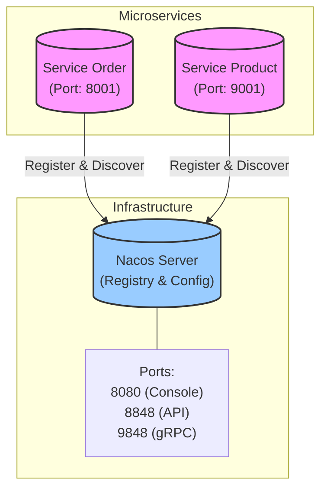
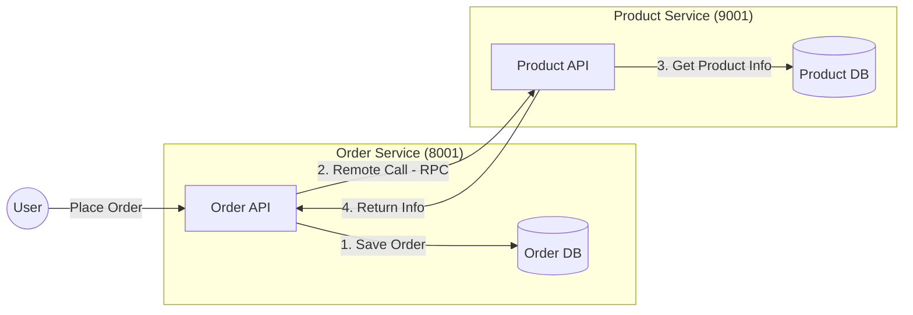

# rainy-spring-cloud


☔ Experiments with Distributed Systems in Spring Cloud.

## Architecture



## Project Structure

This is a multi-module Maven project structured as follows:

```
rainy-spring-cloud
├── services               # Container for microservices
│   ├── service-order      # Order Management Service
│   └── service-product    # Product Management Service
└── pom.xml                # Root Maven configuration
```

## Technology Stack

- **Java**: 17
- **Spring Boot**: 3.5.9
- **Spring Cloud**: 2025.0.1
- **Spring Cloud Alibaba**: 2025.0.0.0
- **Service Discovery**: Nacos

## 1. Service Registry (Nacos)

### What & Why
**Concept**: A central "phonebook" where microservices list their current contact info (IP & Port).
**Importance**: In cloud environments, services scale up/down and change IPs dynamically. Hardcoding addresses is impossible.

### Action Items
1.  **Start Server**: Run Nacos (the phonebook manager).
2.  **Register Client**: Configure Spring Boot apps to tell Nacos "I am here!".

### Local Setup (Server)
- Docker (standalone):

Generate a token (any of these):

```bash
# OpenSSL (recommended)
openssl rand -base64 32

# Python
python - <<'PY'
import os, base64; print(base64.b64encode(os.urandom(32)).decode())
PY

# Node.js
node -e "console.log(require('crypto').randomBytes(32).toString('base64'))"
```

```bash
TOKEN=$(openssl rand -base64 32)
docker run --name nacos-standalone-derby \
  -e MODE=standalone \
  -e NACOS_AUTH_TOKEN=$TOKEN \
  -e NACOS_AUTH_IDENTITY_KEY=nacos \
  -e NACOS_AUTH_IDENTITY_VALUE=nacos \
  -p 8080:8080 \
  -p 8848:8848 \
  -p 9848:9848 \
  -d nacos/nacos-server:latest
```

- Binary:

```bash
sh bin/startup.sh -m standalone
# stop:
sh bin/shutdown.sh
```

- Console: http://localhost:8080
- Tested on Nacos v3.1.1 (current latest)
- First login credentials: username nacos, password nacos

### Wire Services to Nacos (Client)
- application.properties (or application.yml):

```properties
spring.application.name=service-order
server.port=8001
spring.cloud.nacos.discovery.server-addr=127.0.0.1:8848

# Nacos Authentication (Required if auth is enabled on server)
spring.cloud.nacos.discovery.username=nacos
spring.cloud.nacos.discovery.password=nacos
```

- Spring Boot main class:

```java
@SpringBootApplication
@EnableDiscoveryClient
public class OrderApplication {
  public static void main(String[] args) {
    SpringApplication.run(OrderApplication.class, args);
  }
}
```

Notes:
- Ports: 8080 (console UI), 8848 (HTTP API), 9848 (gRPC channels in Nacos 2.x/3.x)
- Current modules are POM-only; add Spring Boot apps and configs to see registrations in the console

### Verification
If configured correctly, you should see logs similar to this upon startup:
```text
INFO ... [AbilityControlManager] Successfully initialize AbilityControlManager 
INFO ... [NacosServiceRegistry] nacos registry, DEFAULT_GROUP service-order 192.168.1.88:8001 register finished 
```

## 2. Service Discovery

### What & Why
**Concept**: The ability for one service to look up the "phonebook" (Registry) to find the location of another service.
**Importance**: Enables decoupling. `Service A` doesn't need to know where `Service B` is, it just asks the Registry.

### How to Use
Spring Cloud provides the `DiscoveryClient` abstraction.

**Code Example (`DiscoveryTest.java`):**

```java
@Autowired
private DiscoveryClient discoveryClient;

@Test
public void testDiscovery() {
    // Get all known service names
    for (String serviceId : discoveryClient.getServices()) {
        System.out.println("Found Service: " + serviceId);
        
        // Get specific instances for a service
        List<ServiceInstance> instances = discoveryClient.getInstances(serviceId);
        for (ServiceInstance instance : instances) {
            System.out.println(" - " + instance.getHost() + ":" + instance.getPort());
        }
    }
}
```

### Pro Tip: Simulating Clusters in IntelliJ IDEA
You can easily simulate a cluster (multiple instances of the same service) locally:
1.  Open **Run/Debug Configurations**.
2.  Select a service (e.g., `OrderMainApplication`).
3.  Click **Copy Configuration** (or press `Ctrl+D` / `Cmd+D`).
4.  In the new configuration, add to **Program arguments**: `--server.port=8082` (or any other free port).
5.  Run both the original and the copy.
6.  Check the Nacos Console: you will see `service-order` with **2 instances**.

## 3. Remote Procedure Call (RPC)

### Architecture
We are building a system where the **Order Service** needs to fetch product details from the **Product Service**.



### Plan
1.  **Setup Database**: Create schema for Order and Product services.
2.  **Shared Module**: Create `rainy-common` to hold shared entities (POJOs).
3.  **Implement RPC**: Use OpenFeign (declarative HTTP client) to call Product Service from Order Service.

### Database Setup
Run the following SQL scripts to initialize your database.
**Note**: We intentionally **avoid Foreign Keys** to keep microservices decoupled and performance high. Logic is handled in the application layer.

#### Product Service Database (`rainy_product`)

```sql
CREATE DATABASE IF NOT EXISTS rainy_product;
USE rainy_product;

CREATE TABLE t_product (
    id BIGINT PRIMARY KEY AUTO_INCREMENT COMMENT 'Product ID',
    name VARCHAR(255) NOT NULL COMMENT 'Product Name',
    price DECIMAL(10, 2) NOT NULL COMMENT 'Current Price',
    stock INT NOT NULL COMMENT 'Remaining Inventory',
    INDEX idx_name (name)
) COMMENT 'Product Master Catalog';
```

#### Order Service Database (`rainy_order`)

```sql
CREATE DATABASE IF NOT EXISTS rainy_order;
USE rainy_order;

CREATE TABLE t_order (
    id BIGINT PRIMARY KEY AUTO_INCREMENT COMMENT 'Order ID',
    user_id BIGINT COMMENT 'User ID',
    nick_name VARCHAR(255) COMMENT 'User Nickname',
    address VARCHAR(255) COMMENT 'Shipping Address',
    total_amount DECIMAL(10, 2) COMMENT 'Total Order Cost',
    INDEX idx_user_id (user_id)
) COMMENT 'Order Header';

CREATE TABLE t_order_item (
    id BIGINT PRIMARY KEY AUTO_INCREMENT,
    order_id BIGINT NOT NULL COMMENT 'Links to t_order.id',
    product_id BIGINT NOT NULL COMMENT 'Links to t_product.id',
    product_name VARCHAR(255) COMMENT 'Snapshot of name',
    product_price DECIMAL(10, 2) COMMENT 'Snapshot of price',
    num INT NOT NULL COMMENT 'Quantity',
    INDEX idx_order_id (order_id),
    INDEX idx_product_id (product_id)
) COMMENT 'Order Items (No Foreign Keys)';
```

### Mock Data
Insert some initial data into the Product Service so we can test the RPC call later.

```sql
USE rainy_product;

INSERT INTO t_product (name, price, stock) VALUES 
('Rainy Cloud Umbrella', 99.00, 100),
('Spring Boot Mug', 25.50, 500),
('Java 17 Sticker', 5.00, 1000);
```

### Understanding Order Creation Logic
When a user places an order (e.g., `GET /order/create?userId=1&productId=100`), the following happens behind the scenes.
**Note**: We use `MyBatis-Plus` to simplify database interactions.

#### 1. The Logic Flow
1.  **Receive Request**: `OrderController` receives `userId` and `productId`.
2.  **Remote Call (RPC)**: `OrderService` asks `ProductService` for the price of `productId`.
3.  **Calculate Total**: Price * 1 (simple example).
4.  **Save Order**: Insert a row into `t_order`.
5.  **Save Item**: Insert a row into `t_order_item` to link the product to this order.

#### 2. Behind the Scenes (SQL)
Here is what the generated SQL looks like for a typical transaction:

**Step A: Get Product (RPC Call)**
*Executed by Product Service*
```sql
SELECT id, name, price, stock FROM t_product WHERE id = 100;
```

**Step B: Save Order Header**
*Executed by Order Service*
```sql
INSERT INTO t_order (user_id, nick_name, total_amount, address) 
VALUES (1, 'RainyUser', 99.00, 'Cloud City');
```
*MyBatis-Plus automatically retrieves the new `id` (e.g., `5001`).*

**Step C: Save Order Item**
*Executed by Order Service*
```sql
INSERT INTO t_order_item (order_id, product_id, product_name, product_price, num) 
VALUES (5001, 100, 'Rainy Cloud Umbrella', 99.00, 1);
```

#### 3. Code Structure (MyBatis-Plus)

**Entities**
These classes map directly to your database tables.

```java
@Data
@TableName("t_order")
public class Order {
    @TableId(type = IdType.AUTO)
    private Long id;
    private Long userId;
    private String nickName;
    private BigDecimal totalAmount;
    
    // Not in DB table, but useful for JSON response!
    @TableField(exist = false)
    private List<Product> productList;
}
```

**Mappers**
Interfaces that handle the SQL execution. By extending `BaseMapper<T>`, you get instant CRUD powers.

**1. ProductMapper**
```java
@Mapper
public interface ProductMapper extends BaseMapper<Product> {
    // Inherited methods:
    // int insert(Product entity);
    // Product selectById(Serializable id);
    // int updateById(Product entity);
    // int deleteById(Serializable id);
    // ... and many more!
}
```

**2. OrderMapper (with Custom SQL)**
If the built-in methods aren't enough, you can write your own SQL easily.

```java
@Mapper
public interface OrderMapper extends BaseMapper<Order> {
    
    // Example: Custom SQL with annotation
    @Select("SELECT * FROM t_order WHERE user_id = #{userId}")
    List<Order> findByUserId(Long userId);
}
```

**3. OrderItemMapper**
```java
@Mapper
public interface OrderItemMapper extends BaseMapper<OrderItem> {
    // Just empty is fine for standard usage!
}
```

## Modules

### Root Configuration

The root `pom.xml` serves as the parent project, managing:
- **Dependency Versions**: Centralizes versions for Spring Boot (3.5.9), Spring Cloud (2025.0.1), and Spring Cloud Alibaba (2025.0.0.0).
- **Bill of Materials (BOM)**: Imports `spring-cloud-dependencies` and `spring-cloud-alibaba-dependencies` for consistent dependency management across modules.

### Services

The `services` module serves as a grouping for the microservices in the system.

- **service-order**: Responsible for order processing and management.
- **service-product**: Responsible for product catalog and inventory management.
