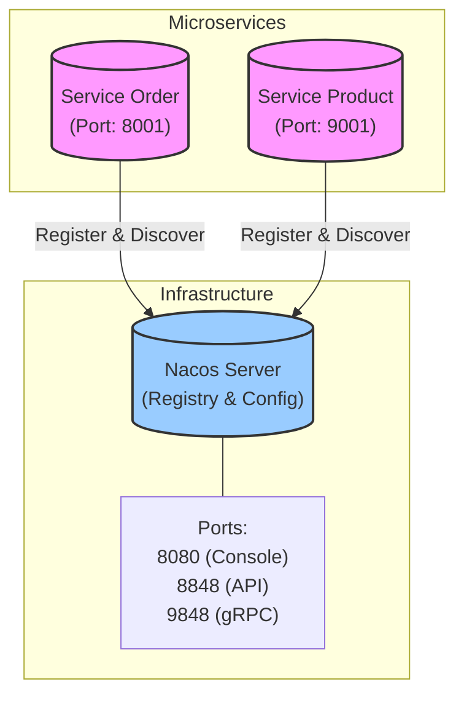

# rainy-spring-cloud


☔ Experiments with Distributed Systems in Spring Cloud.

## Architecture



## Project Structure

This is a multi-module Maven project structured as follows:

```
rainy-spring-cloud
├── services               # Container for microservices
│   ├── service-order      # Order Management Service
│   └── service-product    # Product Management Service
└── pom.xml                # Root Maven configuration
```

## Technology Stack

- **Java**: 17
- **Spring Boot**: 3.5.9
- **Spring Cloud**: 2025.0.1
- **Spring Cloud Alibaba**: 2025.0.0.0
- **Service Discovery**: Nacos

## 1. Service Registry (Nacos)

### What & How
**Goal**: Enable services to find each other dynamically without hardcoding IP addresses and ports.

**Implementation**:
1.  **Registry Server**: We use **Nacos** (running in Docker) as the central phonebook.
2.  **Client Registration**: Each Spring Boot service uses `spring-cloud-starter-alibaba-nacos-discovery` to automatically register itself with Nacos upon startup.
3.  **Discovery**: Services can query Nacos to find the current IP:Port of other services.

### Local Setup (Server)
- Docker (standalone):

Generate a token (any of these):

```bash
# OpenSSL (recommended)
openssl rand -base64 32

# Python
python - <<'PY'
import os, base64; print(base64.b64encode(os.urandom(32)).decode())
PY

# Node.js
node -e "console.log(require('crypto').randomBytes(32).toString('base64'))"
```

```bash
TOKEN=$(openssl rand -base64 32)
docker run --name nacos-standalone-derby \
  -e MODE=standalone \
  -e NACOS_AUTH_TOKEN=$TOKEN \
  -e NACOS_AUTH_IDENTITY_KEY=nacos \
  -e NACOS_AUTH_IDENTITY_VALUE=nacos \
  -p 8080:8080 \
  -p 8848:8848 \
  -p 9848:9848 \
  -d nacos/nacos-server:latest
```

- Binary:

```bash
sh bin/startup.sh -m standalone
# stop:
sh bin/shutdown.sh
```

- Console: http://localhost:8080
- Tested on Nacos v3.1.1 (current latest)
- First login credentials: username nacos, password nacos

### Wire Services to Nacos (Client)
- application.properties (or application.yml):

```properties
spring.application.name=service-order
server.port=8001
spring.cloud.nacos.discovery.server-addr=127.0.0.1:8848

# Nacos Authentication (Required if auth is enabled on server)
spring.cloud.nacos.discovery.username=nacos
spring.cloud.nacos.discovery.password=nacos
```

- Spring Boot main class:

```java
@SpringBootApplication
@EnableDiscoveryClient
public class OrderApplication {
  public static void main(String[] args) {
    SpringApplication.run(OrderApplication.class, args);
  }
}
```

Notes:
- Ports: 8080 (console UI), 8848 (HTTP API), 9848 (gRPC channels in Nacos 2.x/3.x)
- Current modules are POM-only; add Spring Boot apps and configs to see registrations in the console

### Verification
If configured correctly, you should see logs similar to this upon startup:
```text
INFO ... [AbilityControlManager] Successfully initialize AbilityControlManager 
INFO ... [NacosServiceRegistry] nacos registry, DEFAULT_GROUP service-order 192.168.1.88:8001 register finished 
```

### Pro Tip: Simulating Clusters in IntelliJ IDEA
You can easily simulate a cluster (multiple instances of the same service) locally:
1.  Open **Run/Debug Configurations**.
2.  Select a service (e.g., `OrderMainApplication`).
3.  Click **Copy Configuration** (or press `Ctrl+D` / `Cmd+D`).
4.  In the new configuration, add to **Program arguments**: `--server.port=8082` (or any other free port).
5.  Run both the original and the copy.
6.  Check the Nacos Console: you will see `service-order` with **2 instances**.

## Modules

### Root Configuration

The root `pom.xml` serves as the parent project, managing:
- **Dependency Versions**: Centralizes versions for Spring Boot (3.5.9), Spring Cloud (2025.0.1), and Spring Cloud Alibaba (2025.0.0.0).
- **Bill of Materials (BOM)**: Imports `spring-cloud-dependencies` and `spring-cloud-alibaba-dependencies` for consistent dependency management across modules.

### Services

The `services` module serves as a grouping for the microservices in the system.

- **service-order**: Responsible for order processing and management.
- **service-product**: Responsible for product catalog and inventory management.
