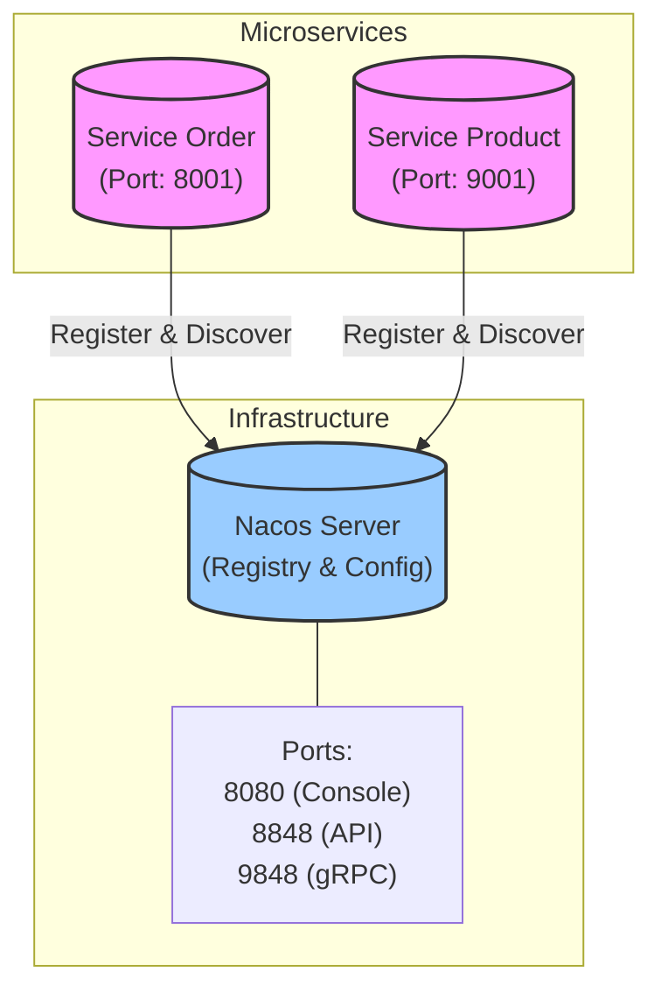
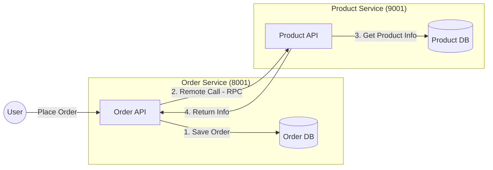
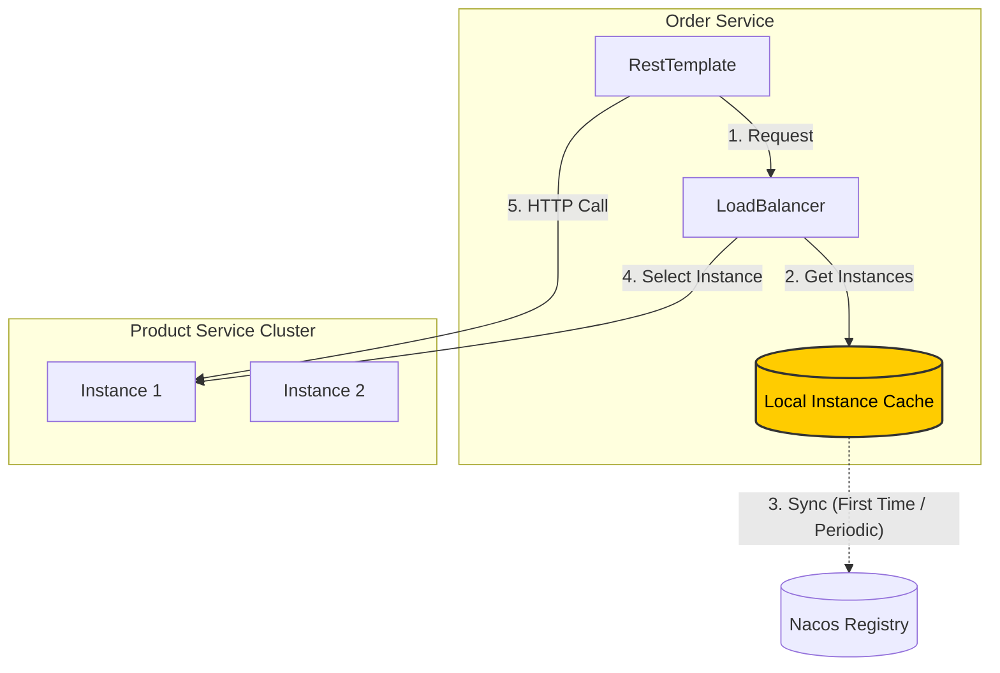
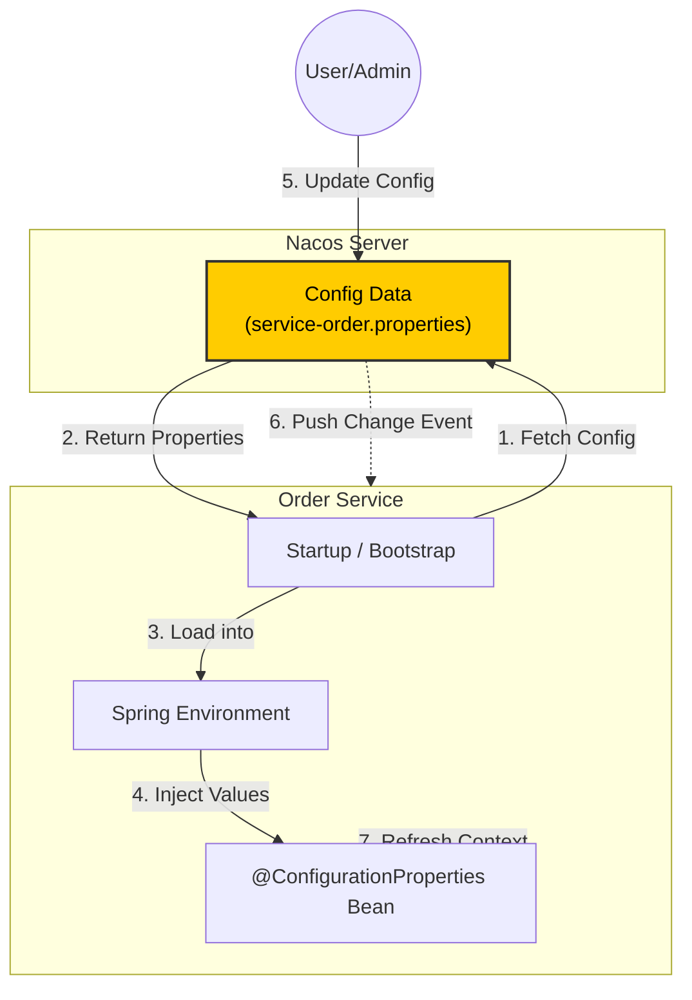
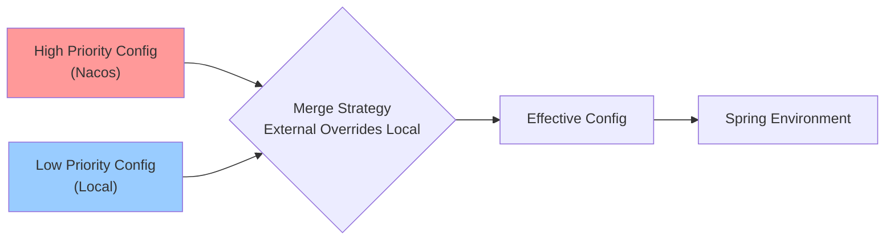
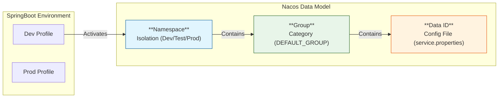
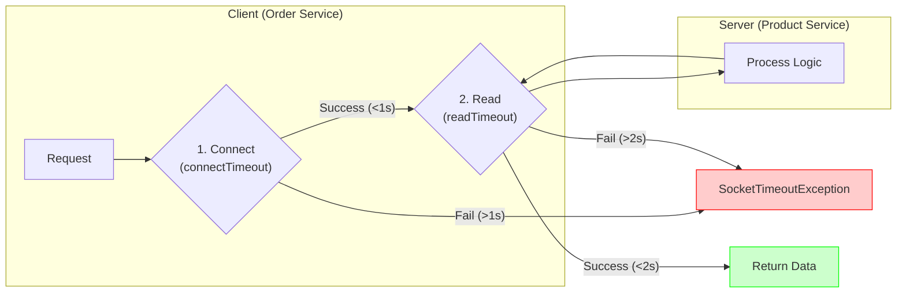
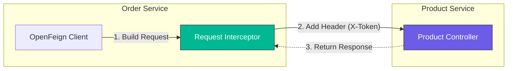
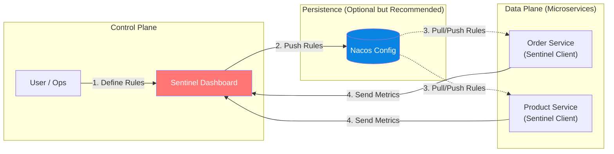
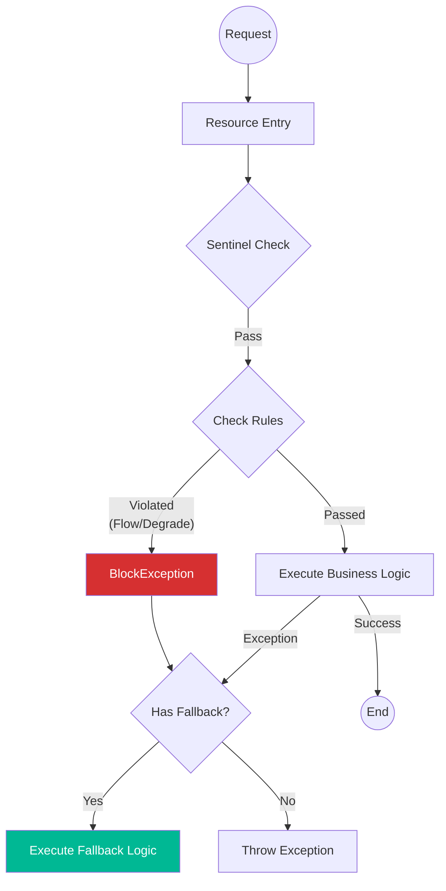

# rainy-spring-cloud


☔ Experiments with Distributed Systems in Spring Cloud.

## Architecture



## Project Structure

This is a multi-module Maven project structured as follows:

```
rainy-spring-cloud
├── rainy-common            # Shared entities (Order/Product/...)
├── services               # Container for microservices
│   ├── service-order      # Order Management Service
│   └── service-product    # Product Management Service
└── pom.xml                # Root Maven configuration
```

## Technology Stack

- **Java**: 17
- **Spring Boot**: 3.5.9
- **Spring Cloud**: 2025.0.1
- **Spring Cloud Alibaba**: 2025.0.0.0
- **Service Discovery**: Nacos

## Quick Start (Local)

Prereqs: Nacos at `127.0.0.1:8848` and MySQL schemas `rainy_product` / `rainy_order` (see “Database Setup”).

```bash
# Start service-product (default: 9001)
./mvnw -pl services/service-product spring-boot:run

# Start service-order (default: 8001)
./mvnw -pl services/service-order spring-boot:run
```

```bash
# Smoke checks
curl http://localhost:9001/hello
curl http://localhost:9001/product/1
curl -X POST "http://localhost:8001/order/create?userId=1&productId=1&count=1"
curl http://localhost:8001/config
```

## 1. Service Registry (Nacos)

### What & Why
**Concept**: A central "phonebook" where microservices list their current contact info (IP & Port).
**Importance**: In cloud environments, services scale up/down and change IPs dynamically. Hardcoding addresses is impossible.

### Action Items
1.  **Start Server**: Run Nacos (the phonebook manager).
2.  **Register Client**: Configure Spring Boot apps to tell Nacos "I am here!".

### Local Setup (Server)
- Docker (standalone):

Generate a token (any of these):

```bash
# OpenSSL (Recommended ★)
openssl rand -base64 32

# Python
python - <<'PY'
import os, base64; print(base64.b64encode(os.urandom(32)).decode())
PY

# Node.js
node -e "console.log(require('crypto').randomBytes(32).toString('base64'))"
```

```bash
TOKEN=$(openssl rand -base64 32)
docker run --name nacos-standalone-derby \
  -e MODE=standalone \
  -e NACOS_AUTH_TOKEN=$TOKEN \
  -e NACOS_AUTH_IDENTITY_KEY=nacos \
  -e NACOS_AUTH_IDENTITY_VALUE=nacos \
  -p 8080:8080 \
  -p 8848:8848 \
  -p 9848:9848 \
  -d nacos/nacos-server:v3.1.1
```

- Binary:

```bash
sh bin/startup.sh -m standalone
# stop:
sh bin/shutdown.sh
```

- Console: http://localhost:8080
- Tested on Nacos v3.1.1
- First login credentials: username nacos, password nacos

### Wire Services to Nacos (Client)
- application.properties (or application.yml):

```properties
spring.application.name=service-order
server.port=8001
spring.cloud.nacos.discovery.server-addr=127.0.0.1:8848

# Nacos Authentication (Required if auth is enabled on server)
spring.cloud.nacos.discovery.username=nacos
spring.cloud.nacos.discovery.password=nacos
```

- Spring Boot main class:

```java
@SpringBootApplication
@EnableDiscoveryClient
public class OrderMainApplication {
  public static void main(String[] args) {
    SpringApplication.run(OrderMainApplication.class, args);
  }
}
```

Notes:
- Ports: 8080 (console UI), 8848 (HTTP API), 9848 (gRPC channels in Nacos 2.x/3.x)
- Both services are runnable Spring Boot apps; start them to see registrations in the console

### Verification
If configured correctly, you should see logs similar to this upon startup:
```text
INFO ... [AbilityControlManager] Successfully initialize AbilityControlManager 
INFO ... [NacosServiceRegistry] nacos registry, DEFAULT_GROUP service-order 192.168.1.88:8001 register finished 
```

## 2. Service Discovery

### What & Why
**Concept**: The ability for one service to look up the "phonebook" (Registry) to find the location of another service.
**Importance**: Enables decoupling. `Service A` doesn't need to know where `Service B` is, it just asks the Registry.

### How to Use
Spring Cloud provides the `DiscoveryClient` abstraction.

**Code Example (`DiscoveryTest.java`):**

```java
@Autowired
private DiscoveryClient discoveryClient;

@Test
public void testDiscovery() {
    // Get all known service names
    for (String serviceId : discoveryClient.getServices()) {
        System.out.println("Found Service: " + serviceId);
        
        // Get specific instances for a service
        List<ServiceInstance> instances = discoveryClient.getInstances(serviceId);
        for (ServiceInstance instance : instances) {
            System.out.println(" - " + instance.getHost() + ":" + instance.getPort());
        }
    }
}
```

### Pro Tip: Simulating Clusters in IntelliJ IDEA
You can easily simulate a cluster (multiple instances of the same service) locally:
1.  Open **Run/Debug Configurations**.
2.  Select a service (e.g., `OrderMainApplication`).
3.  Click **Copy Configuration** (or press `Ctrl+D` / `Cmd+D`).
4.  In the new configuration, add to **Program arguments**: `--server.port=8002` (or any other free port).
5.  Run both the original and the copy.
6.  Check the Nacos Console: you will see `service-order` with **2 instances**.

## 3. Remote Procedure Call (RPC)

### Architecture
We are building a system where the **Order Service** needs to fetch product details from the **Product Service**.



### Plan
1.  **Setup Database**: Create schema for Order and Product services.
2.  **Shared Module**: Create `rainy-common` to hold shared entities (POJOs).
3.  **Implement RPC**: Use `RestTemplate` + `DiscoveryClient` (Manual Load Balancing) to call Product Service from Order Service.

### Implementation Summary (Crux)
We implemented a **manual Remote Procedure Call (RPC)** to connect the services.

**The Goal**: `Order Service` needs to talk to `Product Service` to get product details (price, name).

**The "Simple" Approach (Current Implementation)**:
Instead of using OpenFeign (not wired yet), we did it manually to understand the core concept:
1.  **Discovery**: We used `DiscoveryClient` to ask Nacos: *"Who handles 'service-product'?"*
2.  **Selection**: We blindly picked the **first available instance** (`instances.get(0)`).
3.  **Call**: We constructed a URL (`http://ip:port/product/{id}`) and fired a GET request using `RestTemplate`.

**Code Snippet (`OrderServiceImpl.java`)**:
```java
// 1. Ask Nacos for "service-product" instances
List<ServiceInstance> instances = discoveryClient.getInstances("service-product");

// 2. Pick the first one (Manual Load Balancing strategy: First Available)
ServiceInstance instance = instances.get(0);

// 3. Build URL and call
String url = String.format("http://%s:%s/product/%s", instance.getHost(), instance.getPort(), productId);
Product product = restTemplate.getForObject(url, Product.class);
```
*This is the foundational "glue" of microservices before adding magic like LoadBalancer or Feign.*

### Database Setup
Run the following SQL scripts to initialize your database.
**Note**: We intentionally **avoid Foreign Keys** to keep microservices decoupled and performance high. Logic is handled in the application layer.

#### Product Service Database (`rainy_product`)

```sql
CREATE DATABASE IF NOT EXISTS rainy_product;
USE rainy_product;

CREATE TABLE t_product (
    id BIGINT PRIMARY KEY AUTO_INCREMENT COMMENT 'Product ID',
    name VARCHAR(255) NOT NULL COMMENT 'Product Name',
    price DECIMAL(10, 2) NOT NULL COMMENT 'Current Price',
    stock INT NOT NULL COMMENT 'Remaining Inventory',
    INDEX idx_name (name)
) COMMENT 'Product Master Catalog';
```

#### Order Service Database (`rainy_order`)

```sql
CREATE DATABASE IF NOT EXISTS rainy_order;
USE rainy_order;

CREATE TABLE t_order (
    id BIGINT PRIMARY KEY AUTO_INCREMENT COMMENT 'Order ID',
    user_id BIGINT COMMENT 'User ID',
    nick_name VARCHAR(255) COMMENT 'User Nickname',
    address VARCHAR(255) COMMENT 'Shipping Address',
    total_amount DECIMAL(10, 2) COMMENT 'Total Order Cost',
    INDEX idx_user_id (user_id)
) COMMENT 'Order Header';

CREATE TABLE t_order_item (
    id BIGINT PRIMARY KEY AUTO_INCREMENT,
    order_id BIGINT NOT NULL COMMENT 'Links to t_order.id',
    product_id BIGINT NOT NULL COMMENT 'Links to t_product.id',
    product_name VARCHAR(255) COMMENT 'Snapshot of name',
    product_price DECIMAL(10, 2) COMMENT 'Snapshot of price',
    num INT NOT NULL COMMENT 'Quantity',
    INDEX idx_order_id (order_id),
    INDEX idx_product_id (product_id)
) COMMENT 'Order Items (No Foreign Keys)';
```

### Mock Data
Insert some initial data into the Product Service so we can test the RPC call later.

```sql
USE rainy_product;

INSERT INTO t_product (name, price, stock) VALUES 
('Rainy Cloud Umbrella', 99.00, 100),
('Spring Boot Mug', 25.50, 500),
('Java 17 Sticker', 5.00, 1000);
```

### Understanding Order Creation Logic
When a user places an order (e.g., `POST /order/create?userId=1&productId=2`), the following happens behind the scenes.
**Note**: We use `MyBatis-Plus` to simplify database interactions.

#### 1. The Logic Flow
1.  **Receive Request**: `OrderController` receives `userId` and `productId`.
2.  **Remote Call (RPC)**: `OrderService` asks `ProductService` for the price of `productId`.
3.  **Calculate Total**: Price * 1 (simple example).
4.  **Save Order**: Insert a row into `t_order`.
    *   *Magic*: MyBatis-Plus automatically fills `order.id` with the new database ID (e.g., 5001) right after insertion.
5.  **Save Item**: Insert a row into `t_order_item` using that new `order.id` to link them.

#### 2. Behind the Scenes (SQL)
Here is what the generated SQL looks like for a typical transaction:

**Step A: Get Product (RPC Call)**
*Executed by Product Service*
```sql
SELECT id, name, price, stock FROM t_product WHERE id = 2;
```

**Step B: Save Order Header**
*Executed by Order Service*
```sql
INSERT INTO t_order (user_id, nick_name, total_amount, address) 
VALUES (1, 'RainyUser', 25.50, 'Cloud City');
```
*MyBatis-Plus automatically retrieves the new `id` (e.g., `5001`).*

**Step C: Save Order Item**
*Executed by Order Service*
```sql
INSERT INTO t_order_item (order_id, product_id, product_name, product_price, num) 
VALUES (5001, 2, 'Spring Boot Mug', 25.50, 1);
```

#### 3. Code Structure (MyBatis-Plus)

**Entities**
These classes map directly to your database tables.

```java
@Data
@TableName("t_order")
public class Order {
    @TableId(type = IdType.AUTO)
    private Long id;
    private Long userId;
    private String nickName;
    private BigDecimal totalAmount;
    
    // Not in DB table, but useful for JSON response!
    @TableField(exist = false)
    private List<Product> productList;
}
```

**Mappers**
Interfaces that handle the SQL execution. By extending `BaseMapper<T>`, you get instant CRUD powers.

**1. ProductMapper**
```java
@Mapper
public interface ProductMapper extends BaseMapper<Product> {
    // Inherited methods:
    // int insert(Product entity);
    // Product selectById(Serializable id);
    // int updateById(Product entity);
    // int deleteById(Serializable id);
    // ... and many more!
}
```

**2. OrderMapper (with Custom SQL)**
If the built-in methods aren't enough, you can write your own SQL easily.

```java
@Mapper
public interface OrderMapper extends BaseMapper<Order> {
    
    // Example: Custom SQL with annotation
    @Select("SELECT * FROM t_order WHERE user_id = #{userId}")
    List<Order> findByUserId(Long userId);
}
```

**3. OrderItemMapper**
```java
@Mapper
public interface OrderItemMapper extends BaseMapper<OrderItem> {
    // Just empty is fine for standard usage!
}
```

#### 4. Response Example
After a successful `POST /order/create?userId=1&productId=2&count=3`, you will receive a JSON response similar to this:

```json
{ 
  "id": 14, 
  "userId": 1, 
  "nickName": "DIO", 
  "address": "Cairo, Egypt", 
  "totalAmount": 76.50, 
  "productList": [ 
    { 
      "id": 2, 
      "name": "Spring Boot Mug", 
      "price": 25.50, 
      "stock": 500,
      "num": 3 
    } 
  ] 
}
```

## 4. Load Balancing

### Why?
In a real production environment, you will likely have multiple instances of `service-product` running (e.g., on ports 9001, 9002, 9003) to handle high traffic. If `service-order` hardcodes the URL to `http://localhost:9001`, it defeats the purpose of clustering. We need a way to distribute requests across all available instances.

### Dependencies
Since Spring Cloud 2020.0, the old Netflix Ribbon has been removed. We now use **Spring Cloud LoadBalancer**.

Ensure `service-order/pom.xml` includes:
```xml
<dependency>
    <groupId>org.springframework.cloud</groupId>
    <artifactId>spring-cloud-loadbalancer</artifactId>
</dependency>
```

### Approach 1: `LoadBalancerClient` (Manual)
This is the "under-the-hood" way. You explicitly ask the Load Balancer to pick a service instance for you.

```java
@Autowired
private LoadBalancerClient loadBalancerClient;

public void callService() {
    // 1. Ask Load Balancer to choose an instance of 'service-product'
    ServiceInstance instance = loadBalancerClient.choose("service-product");
    
    // 2. Build the URL using the chosen instance's IP and Port
    String url = String.format("http://%s:%s/product/%s", instance.getHost(), instance.getPort(), 1);
    
    // 3. Make the call
    restTemplate.getForObject(url, Product.class);
}
```

### Approach 2: `@LoadBalanced` Annotation (Recommended ★)
This is the standard, most convenient way. Spring injects an interceptor into your `RestTemplate` that automatically resolves service names to IPs.

**1. Configure RestTemplate**
Add `@LoadBalanced` to your bean definition.

```java
@Configuration
public class OrderConfig {
    @Bean
    @LoadBalanced // <--- The Magic Annotation
    public RestTemplate restTemplate() {
        return new RestTemplate();
    }
}
```

**2. Use Service Name in URL**
Now, instead of `localhost:9001`, you use the **Service Name** (`service-product`) registered in Nacos.

```java
// The URL is now host-agnostic!
String url = "http://service-product/product/" + productId;
Product product = restTemplate.getForObject(url, Product.class);
```

**How it works:**
1. Spring sees `http://service-product/...`.
2. The `LoadBalancerInterceptor` pauses the request.
3. It asks the Load Balancer: "Give me an instance for 'service-product'".
4. It rewrites the URL to `http://192.168.1.5:9001/...` and lets the request proceed.

### Client-Side vs Server-Side Load Balancing

**Client-side load balancing**
- The caller resolves service instances and picks one to call.
- Usually paired with a registry (Nacos) and a client library (Spring Cloud LoadBalancer).
- In this project: `RestTemplate` + `@LoadBalanced` calling `http://service-product/...`, or Feign with `name = "service-product"` (after enabling Feign).

**Server-side load balancing**
- The caller sends traffic to a single endpoint (VIP / gateway / DNS name).
- A load balancer routes to instances behind it (Nginx/HAProxy, cloud LB, Kubernetes Service, API Gateway).
- Typical for third-party APIs: you call `https://api.vendor.com/...` and the vendor does the balancing.

### Caching Mechanism (Important)
The client maintains a **local cache** of the service registry (the "phonebook").

1.  **First Call**: The client pulls the list of available instances from Nacos and caches it locally.
2.  **Subsequent Calls**: The client uses the **local cache** to pick an instance (Load Balancing), avoiding a network trip to Nacos for every request.
3.  **Background Updates**: The cache is periodically updated to reflect changes (e.g., new instances or crashes).
4.  **Resilience**: If Nacos goes down, your services can **still communicate** because they rely on the local cache!



## 5. Distributed Configuration (Nacos Config)

### What & Why
**Concept**: Centralizing configuration files (like `application.properties`) in the server (Nacos) instead of hardcoding them in each service.
**Importance**:
1.  **Dynamic Updates**: Change config on the fly without restarting the service.
2.  **Central Management**: View and manage all configs in one place.

### Implementation Status
Currently, **Service Order** is fully configured to use Nacos Config.

### How to Use

#### 1. Add Dependency
`service-order/pom.xml`:
```xml
<dependency>
    <groupId>com.alibaba.cloud</groupId>
    <artifactId>spring-cloud-starter-alibaba-nacos-config</artifactId>
</dependency>
```

#### 2. Configure Import (Spring Boot 2.4+)
`service-order/src/main/resources/application.properties`:
```properties
# Tell Spring to load config from Nacos
spring.config.import=nacos:service-order.properties

# You can also specify the Group:
# spring.config.import=nacos:service-order.properties?group=DEFAULT_GROUP
```

#### 3. Create Config in Nacos
1.  Go to Nacos Console: `http://localhost:8080/nacos` -> **Config Management** -> **Configurations**.
2.  Click **+** (Create).
3.  **Data ID**: `service-order.properties` (Must match the import above).
4.  **Group**: `DEFAULT_GROUP`.
5.  **Configuration Content**:
    ```properties
    order.timeout=300min
    order.auto-confirm=7d
    ```
    6.  Click **Publish**.

#### 4. Dynamic Refresh (Recommended: `@ConfigurationProperties`)
We expose `/config` from `OrderController` and bind Nacos config via `@ConfigurationProperties` (`OrderServiceProperties`). This keeps controllers clean and avoids `@Value` usage.

```java
@RestController
public class OrderController {
    
    // ...
}
```

#### 5. Alternative (Recommended ★): Configuration Properties
Instead of using `@Value` on every controller, you can use a Type-Safe Configuration Properties class.

**Benefit**:
- No special controller annotations needed; `@ConfigurationProperties` gives a clean, typed view of config.
- Strong typing and validation.

**1. Define Properties Class**
`OrderServiceProperties.java`:
```java
@Component
@ConfigurationProperties(prefix = "order")
@Data
public class OrderServiceProperties {
    private String timeout;
    private String autoConfirm;
}
```

**2. Inject and Use**
`OrderController.java`:
```java
@RestController
@RequiredArgsConstructor
public class OrderController {
    
    private final OrderServiceProperties orderServiceProperties;

    @GetMapping("/config")
    public String getConfig() {
        return orderServiceProperties.toString();
    }
}
```

#### 6. Verification
1.  Call `GET http://localhost:8001/config`. You should see the values you set in Nacos.
2.  Change the values in Nacos Console and Publish.
3.  Call the endpoint again. You should see the **new values immediately** without restarting the service!



### Advanced Configuration Topics

#### 1. Config Priorities
When you use Nacos Config, it acts as an "External Configuration" source. In Spring Boot's property resolution order:

1.  **High Priority**: Nacos Config (External)
2.  **Low Priority**: Local `application.properties` / `application.yml`

If a key exists in both, **Nacos wins**.



#### 2. Multiple Imports & Priority
You can import multiple configuration files from Nacos using `spring.config.import`.

**Priority Rule**: In a list of imports, **later imports override earlier ones**.
If `shared-database.properties` and `service-order.properties` both define `timeout`, the one listed **last** "wins".

```properties
# 1. shared-database (Base config)
# 2. service-order (Specific config - Overrides shared if collision)
spring.config.import=nacos:shared-database.properties?group=COMMON_GROUP,nacos:service-order.properties
```

#### 3. Data Organization (Namespace, Group, Data ID)
Nacos uses a hierarchical model to organize configurations, solving the problem of multi-environment and multi-service management.

*   **Namespace**: **Isolation**. Typically used for Environments (Dev, Test, Prod) or Tenants.
    *   Default: `public`.
*   **Group**: **Grouping**. Used for separating services or business units.
    *   Default: `DEFAULT_GROUP`.
*   **Data ID**: **File**. The actual configuration file for a service.
    *   Format: `service-name.properties`.



#### 4. Multi-Environment Support (Best Practice)
To support **Dev**, **Test**, and **Prod** environments, we use **Namespaces**.

**1. Create Namespaces in Nacos**
*   Log in to Nacos Console -> **Namespaces** -> **Create Namespace**.
*   **Name**: `Dev`, **ID**: `dev` (Manually set the ID for easier config; otherwise it's a UUID).
*   Repeat for `test` and `prod`.

**2. Create Configs**
*   Switch to `Dev` namespace. Create `service-order.properties` with dev settings.
*   Switch to `Prod` namespace. Create `service-order.properties` with prod settings.

**3. Activate in Spring Boot**
Use Spring Profiles to switch namespaces.

**application.properties** (Common):
```properties
spring.application.name=service-order
# Default profile
spring.profiles.active=dev
```

**application-dev.properties**:
```properties
# Connect to 'dev' namespace
spring.cloud.nacos.config.namespace=dev
spring.config.import=nacos:service-order.properties
```

**application-prod.properties**:
```properties
# Connect to 'prod' namespace
spring.cloud.nacos.config.namespace=prod
spring.config.import=nacos:service-order.properties
```

**4. Specifying Group and Data ID**
*   **Namespace**: `spring.cloud.nacos.config.namespace`
*   **Group**: Default is `DEFAULT_GROUP`. To change: `spring.cloud.nacos.config.group=MY_GROUP` or in import: `nacos:service-order.properties?group=MY_GROUP`.
*   **Data ID**: Explicitly defined in the import statement (`service-order.properties`).

**Alternative: Single YAML File (`application.yml`)**
Instead of multiple `.properties` files, you can use a single `.yml` file with `---` separators to define profiles.

```yaml
# Common Configuration (Base)
spring:
  application:
    name: service-order
  profiles:
    active: dev # Default profile
---
# Dev Profile Configuration
spring:
  config:
    activate:
      on-profile: dev
  cloud:
    nacos:
      config:
        namespace: dev
        group: DEFAULT_GROUP
    import:
      - nacos:service-order.properties
      - nacos:service-common.properties?group=COMMON_GROUP
---
# Prod Profile Configuration
spring:
  config:
    activate:
      on-profile: prod
  cloud:
    nacos:
      config:
        namespace: prod
    import:
      - nacos:service-order.properties
```

#### 5. Programmatic Config Listener
Sometimes you need to trigger custom logic when a configuration changes (not just updating a Bean). You can register a `Listener` using the Nacos API.

**Example (`OrderMainApplication.java`)**:
We added a listener to log changes whenever `service-order.properties` is updated.

```java
@Bean
public ApplicationRunner nacosConfigListener(NacosConfigManager nacosConfigManager) {
    return args -> {
        ConfigService configService = nacosConfigManager.getConfigService();
        configService.addListener("service-order.properties", "DEFAULT_GROUP", new Listener() {
            @Override
            public Executor getExecutor() {
                return Executors.newFixedThreadPool(4); // Async execution
            }

            @Override
            public void receiveConfigInfo(String configInfo) {
                log.info("Nacos config info changed to: {}", configInfo);
            }
        });
    };
}
```

## 6. OpenFeign (Declarative RPC)

### What & Why
**Concept**: A declarative web service client. You write an interface and annotate it; Spring Cloud generates the implementation at runtime.
**Importance**:
1.  **Cleaner Code**: Eliminates boilerplate `RestTemplate` code.
2.  **Built-in Load Balancing**: Integrates seamlessly with Spring Cloud LoadBalancer.
3.  **Type Safety**: Shared interfaces can ensure type safety between client and server.

### Implementation Status
OpenFeign is present in the project (dependency + `ProductFeignClient`), but the running code path still uses `RestTemplate` + `@LoadBalanced`. To use Feign end-to-end, enable `@EnableFeignClients` in `OrderMainApplication` and switch `OrderServiceImpl` to call `ProductFeignClient`.

### How to Use

#### 1. Add Dependency
`service-order/pom.xml`:
```xml
<dependency>
    <groupId>org.springframework.cloud</groupId>
    <artifactId>spring-cloud-starter-openfeign</artifactId>
</dependency>
```

#### 2. Enable Feign Clients
Add `@EnableFeignClients` to your main application class.

`OrderMainApplication.java`:
```java
@EnableFeignClients
@EnableDiscoveryClient
@SpringBootApplication
public class OrderMainApplication { ... }
```

#### 3. Define Client Interface
Create an interface that mirrors the Controller of the service you want to call.

`ProductFeignClient.java`:
```java
@FeignClient(name = "service-product") // <--- Service Name in Nacos
public interface ProductFeignClient {
    
    @GetMapping("/product/{id}") // <--- Endpoint signature
    Product getProductById(@PathVariable("id") Long productId);
}
```

#### 4. Inject and Use
`OrderServiceImpl.java`:
```java
@RequiredArgsConstructor
@Service
public class OrderServiceImpl implements OrderService {

    private final ProductFeignClient productFeignClient;

    @Override
    public Order createOrder(...) {
        // RPC call (Load Balancing is automatic!)
        Product product = productFeignClient.getProductById(productId);
        // ...
    }
}
```

#### 5. Call Third-Party APIs (Fixed Base URL)
When calling a third-party API (not registered in Nacos), you typically use a fixed base URL.

**1. Configure base URL**
`service-order/src/main/resources/application.properties`:
```properties
thirdparty.weather.base-url=https://example.com
```

**2. Define Feign client**
```java
@FeignClient(name = "thirdparty-weather", url = "${thirdparty.weather.base-url}")
public interface WeatherFeignClient {

    @PostMapping("/whapi/json/alicityweather/condition")
    String getWeather(
            @RequestHeader("Authorization") String authorization,
            @RequestParam("token") String token,
            @RequestParam("cityId") String cityId
    );
}
```

**3. Call it**
```java
String json = weatherFeignClient.getWeather(
        "Bearer <access-token>",
        "<api-token>",
        "101010100"
);
```

Notes:
- Don’t hardcode real credentials in code or README; load them from config or a secret manager.
- With a fixed `url`, Feign is not doing service-discovery-based load balancing; any load balancing (if needed) is handled by DNS or a server-side load balancer in front of the third-party service.

#### 6. Timeout Control

By default, Feign sets conservative timeouts. In production, you must tune these to avoid cascading failures.

**Default Values (Spring Cloud OpenFeign):**
- **Connect Timeout**: 10s (Time to establish TCP connection)
- **Read Timeout**: 60s (Time to wait for response after connection)

**Configuration (`application.yml`):**
You can configure timeouts globally (`default`) or per-client (e.g., `service-product`).

```yaml
spring:
  cloud:
    openfeign:
      client:
        config:
          default: # Global settings
            connectTimeout: 5000 # 5s
            readTimeout: 5000    # 5s
          
          service-product: # Specific override
            connectTimeout: 1000 # 1s (Fast internal call)
            readTimeout: 2000    # 2s
```

**Timeout Flow:**



#### 7. Retry Mechanism

**Default Behavior**:
By default, OpenFeign uses `Retryer.NEVER_RETRY`. This means if a call fails (e.g., timeout or network error), it throws an exception immediately without retrying.

**How to Enable (Not Recommended for all cases)**:
You can enable it by defining a `Retryer` bean.

```java
@Bean
public Retryer feignRetryer() {
    // period=100ms, maxPeriod=1s, maxAttempts=3
    return new Retryer.Default(100, 1000, 3);
}
```

**Common Practice: Should we use it?**

*   **Idempotency Matters**:
    *   ✅ **Safe to Retry**: Idempotent operations like `GET` (reading data) or `PUT` (updating entire resource).
    *   ❌ **Dangerous**: Non-idempotent operations like `POST` (creating orders). Retrying a timed-out `POST` request might result in duplicate orders if the server actually processed the first request but the response was lost.
*   **Recommendation**:
    *   Keep Feign's default `NEVER_RETRY`.
    *   Use **Resilience4j** (Circuit Breaker) for more granular control. It handles retries, fallbacks, and circuit breaking more robustly than Feign's simple retryer.

#### 8. Request Interceptor

**What & Why**:
Interceptors allow you to modify the request template **before** the request is sent. This is crucial for cross-cutting concerns like:
- **Authentication**: Adding `Authorization` headers (e.g., JWT tokens) to every outgoing call.
- **Logging**: Adding correlation IDs.
- **Customization**: Modifying URL parameters dynamically.

**Implementation Example**:
Create a bean that implements `RequestInterceptor`.

```java
@Bean
public RequestInterceptor requestInterceptor() {
    return template -> {
        // Add a custom header to every request
        template.header("X-Token", "SECRET-123");
        
        // Log the request
        System.out.println("Intercepted Feign Request: " + template.url());
    };
}
```

**Interception Flow**:



#### 9. Fallback (Preview)

**What & Why**:
When a remote service fails (timeout, error, or downtime), a **Fallback** provides a default value or alternative logic, preventing the failure from cascading to the user.

**Implementation**:
1.  Create a class implementing the Feign interface (`ProductFeignClient`).
2.  Annotate it with `@Component`.
3.  Link it in `@FeignClient`.

```java
// 1. Define Fallback
@Component
public class ProductFeignClientFallback implements ProductFeignClient {
    @Override
    public Product getProductById(Long id) {
        // Return dummy data or safe default
        return new Product(-1L, "Default Product (Service Down)", BigDecimal.ZERO, 0);
    }
}

// 2. Link in Client
@FeignClient(name = "service-product", fallback = ProductFeignClientFallback.class)
public interface ProductFeignClient { ... }
```

**⚠️ Important Note: Sentinel Integration**
Just defining a `fallback` class **won't work automatically** for circuit breaking in Spring Cloud Alibaba unless a circuit breaker implementation is present and enabled.

In this stack, **Sentinel** is the standard solution.
*   **Without Sentinel**: Fallback might only trigger on specific exceptions (like IO errors) but won't provide true circuit breaking (stop calling after N failures).
*   **With Sentinel**: We get full flow control, degradation, and circuit breaking capabilities.

*We will explore Sentinel in the next chapter to fully activate this feature.*

## 7. Sentinel (Flow Control & Reliability)

### What & Why
Sentinel is a powerful "traffic guard" for microservices. As services communicate, stability becomes critical. Sentinel protects your system from cascading failures using **Flow Control**, **Circuit Breaking**, **System Adaptive Protection**, and **Hotspot Traffic Control**.

### Architecture
Sentinel operates in a Client-Server model:
*   **Sentinel Client (Your App)**: Integrated into microservices (Web, Dubbo, OpenFeign). It reports metrics to the dashboard and pulls rules.
*   **Sentinel Dashboard**: A web console to view real-time metrics and configure rules dynamically.
*   **Rules Storage**: Rules are pushed to clients. For production, they should be persisted in Nacos/Zookeeper (Push Mode).



### Core Concepts: Resources & Rules

1.  **Resources**: Anything you want to protect.
    *   **Auto-Adapted**: Web APIs (`/order/create`), Dubbo methods, Feign clients.
    *   **Manual**: Code blocks wrapped in `@SentinelResource`.
2.  **Rules**: Policies applied to resources.
    *   **Flow Control (`FlowRule`)**: Limit QPS (e.g., max 10 req/s).
    *   **Degrade (`DegradeRule`)**: Circuit breaking (stop calling if error rate > 50% or RT > 500ms).
    *   **System Protection (`SystemRule`)**: Protect based on CPU/Load.
    *   **Hotspot (`ParamFlowRule`)**: Limit specific parameters (e.g., limit `productId=123`).

### Workflow

Every request goes through a chain of slots (processors).



## Modules

### Root Configuration

The root `pom.xml` serves as the parent project, managing:
- **Dependency Versions**: Centralizes versions for Spring Boot (3.5.9), Spring Cloud (2025.0.1), and Spring Cloud Alibaba (2025.0.0.0).
- **Bill of Materials (BOM)**: Imports `spring-cloud-dependencies` and `spring-cloud-alibaba-dependencies` for consistent dependency management across modules.

### Services

The `services` module serves as a grouping for the microservices in the system.

- **service-order**: Responsible for order processing and management.
- **service-product**: Responsible for product catalog and inventory management.

## API Reference

### Product Service (`service-product`)
Base URL: `http://localhost:9001` (or whatever port you configured)

| Method | Endpoint | Description | Parameters |
| :--- | :--- | :--- | :--- |
| `GET` | `/hello` | Health check / Simple greeting | None |
| `GET` | `/product/{id}` | Get product details by ID | `id` (Path Variable): Product ID |

### Order Service (`service-order`)
Base URL: `http://localhost:8001` (or whatever port you configured)

| Method | Endpoint | Description | Parameters |
| :--- | :--- | :--- | :--- |
| `POST` | `/order/create` | Create a new order | `userId` (Query): User ID<br>`productId` (Query): Product ID<br>`count` (Query, default=1): Quantity |

## Troubleshooting

### MyBatis-Plus Dependency Issue
If you encounter `UnsatisfiedDependencyException` or bean creation errors related to `SqlSessionFactory`, check your `mybatis-plus` starter version.

**Issue:** Using `mybatis-plus-spring-boot4-starter` with Spring Boot 3.x can cause compatibility issues.

**Solution:** Use `mybatis-plus-spring-boot3-starter` (or the standard starter which auto-adapts) for Spring Boot 3 projects.

```xml
<!-- Correct dependency for Spring Boot 3 -->
<dependency>
    <groupId>com.baomidou</groupId>
    <artifactId>mybatis-plus-spring-boot3-starter</artifactId>
    <version>3.5.15</version>
</dependency>
```

### Mapper Not Found
If you see `NoSuchBeanDefinitionException` for your mappers:
1. Ensure your mapper interfaces are annotated with `@Mapper`.
2. Or use `@MapperScan("cc.rainyctl.services.*.mapper")` in your main application class.

### Nacos Config Data ID
If your configuration is not being loaded (e.g., values remain null or default):

**Issue:** You created a config with Data ID `service-order` in Nacos, but your app expects a file extension.

**Solution:** The Data ID **must include the extension**.
*   **Wrong:** `service-order`
*   **Correct:** `service-order.properties` (or `.yaml` if using YAML)

This must match what you defined in `spring.config.import`:
```properties
spring.config.import=nacos:service-order.properties
```

## Future Explorations

We are currently using Nacos in **Standalone Mode** with the embedded **Derby** database for simplicity. However, for a production-grade environment, we should explore:

1.  **Nacos with MySQL**:
    *   By default, Nacos uses Derby. Switching to MySQL ensures data persistence and allows easier management of config data.
    *   Requires executing `nacos-mysql.sql` and setting `spring.datasource.platform=mysql` in `custom.properties`.

2.  **Nacos Cluster Mode**:
    *   To ensure High Availability (HA), we should deploy a cluster of Nacos servers (3+ nodes).
    *   Requires a Load Balancer (like Nginx) in front of the cluster.
    *   Configuring `cluster.conf` with IP:Port of all nodes.

For more details, refer to the [Nacos Official Documentation](https://nacos.io/en-us/docs/cluster-mode-quick-start.html).
