# rainy-spring-cloud


[English Docs](./README.md)

☔ Spring Cloud 分布式系统实验。

## 架构

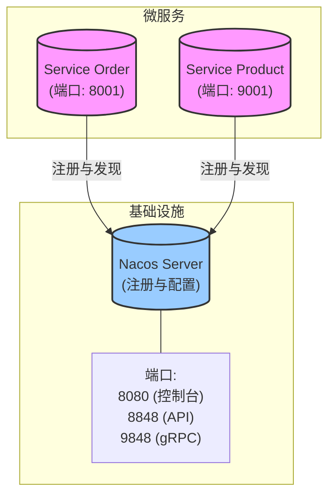

## 项目结构

这是一个多模块 Maven 项目，结构如下：

```
rainy-spring-cloud
├── gateway                 # API 网关 (端口: 7777)
├── rainy-common            # 共享实体 (Order/Product/...)
├── services               # 微服务容器
│   ├── service-order      # 订单管理服务
│   └── service-product    # 商品管理服务
└── pom.xml                # 根 Maven 配置
```

## 技术栈

- **Java**: 17
- **Spring Boot**: 3.5.9
- **Spring Cloud**: 2025.0.1
- **Spring Cloud Alibaba**: 2025.0.0.0
- **Service Discovery**: Nacos

## 快速开始 (本地)

前提条件：Nacos 运行在 `127.0.0.1:8848`，并且 MySQL 包含 `rainy_product` / `rainy_order` 数据库（见“数据库设置”）。

```bash
# 启动 service-product (默认: 9001)
./mvnw -pl services/service-product spring-boot:run

# 启动 service-order (默认: 8001)
./mvnw -pl services/service-order spring-boot:run
```

```bash
# 冒烟测试
curl http://localhost:9001/api/product/hello
curl http://localhost:9001/api/product/1
curl -X POST "http://localhost:8001/api/order/create?userId=1&productId=1&count=1"
curl http://localhost:8001/api/order/config
```

## 1. 服务注册 (Nacos)

### 是什么 & 为什么
**概念**: 一个中心化的“电话簿”，微服务在此列出当前的联系方式（IP & 端口）。
**重要性**: 在云环境中，服务会动态伸缩并改变 IP。硬编码地址是不可能的。

### 行动项
1.  **启动服务器**: 运行 Nacos（电话簿管理器）。
2.  **注册客户端**: 配置 Spring Boot 应用告诉 Nacos “我在这里！”。

### 本地设置 (服务端)
- Docker (单机):

生成一个 Token (任选其一):

```bash
# OpenSSL (推荐 ★)
openssl rand -base64 32

# Python
python - <<'PY'
import os, base64; print(base64.b64encode(os.urandom(32)).decode())
PY

# Node.js
node -e "console.log(require('crypto').randomBytes(32).toString('base64'))"
```

```bash
TOKEN=$(openssl rand -base64 32)
docker run --name nacos-standalone-derby \
  -e MODE=standalone \
  -e NACOS_AUTH_TOKEN=$TOKEN \
  -e NACOS_AUTH_IDENTITY_KEY=nacos \
  -e NACOS_AUTH_IDENTITY_VALUE=nacos \
  -p 8080:8080 \
  -p 8848:8848 \
  -p 9848:9848 \
  -d nacos/nacos-server:v3.1.1
```

- 二进制:

```bash
sh bin/startup.sh -m standalone
# 停止:
sh bin/shutdown.sh
```

- 控制台: http://localhost:8080
- 在 Nacos v3.1.1 上测试通过
- 首次登录凭据: 用户名 nacos, 密码 nacos

### 连接服务到 Nacos (客户端)
- application.properties (或 application.yml):

```properties
spring.application.name=service-order
server.port=8001
spring.cloud.nacos.discovery.server-addr=127.0.0.1:8848

# Nacos 认证 (如果在服务端启用了认证则需要)
spring.cloud.nacos.discovery.username=nacos
spring.cloud.nacos.discovery.password=nacos
```

- Spring Boot 主类:

```java
@SpringBootApplication
@EnableDiscoveryClient
public class OrderMainApplication {
  public static void main(String[] args) {
    SpringApplication.run(OrderMainApplication.class, args);
  }
}
```

注意:
- 端口: 8080 (控制台 UI), 8848 (HTTP API), 9848 (gRPC 通道，Nacos 2.x/3.x)
- 两个服务都是可运行的 Spring Boot 应用；启动它们以在控制台中查看注册情况

### 验证
如果配置正确，启动时应看到类似日志：
```text
INFO ... [AbilityControlManager] Successfully initialize AbilityControlManager 
INFO ... [NacosServiceRegistry] nacos registry, DEFAULT_GROUP service-order 192.168.1.88:8001 register finished 
```

## 2. 服务发现

### 是什么 & 为什么
**概念**: 一个服务查找“电话簿”（注册中心）以找到另一个服务位置的能力。
**重要性**: 实现解耦。`Service A` 不需要知道 `Service B` 在哪里，只需询问注册中心。

### 如何使用
Spring Cloud 提供了 `DiscoveryClient` 抽象。

**代码示例 (`DiscoveryTest.java`):**

```java
@Autowired
private DiscoveryClient discoveryClient;

@Test
public void testDiscovery() {
    // 获取所有已知服务名
    for (String serviceId : discoveryClient.getServices()) {
        System.out.println("Found Service: " + serviceId);
        
        // 获取特定服务的实例
        List<ServiceInstance> instances = discoveryClient.getInstances(serviceId);
        for (ServiceInstance instance : instances) {
            System.out.println(" - " + instance.getHost() + ":" + instance.getPort());
        }
    }
}
```

### 专业提示：在 IntelliJ IDEA 中模拟集群
你可以在本地轻松模拟集群（同一服务的多个实例）：
1.  打开 **Run/Debug Configurations**。
2.  选择一个服务（例如 `OrderMainApplication`）。
3.  点击 **Copy Configuration**（或按 `Ctrl+D` / `Cmd+D`）。
4.  在新配置中，添加到 **Program arguments**: `--server.port=8002`（或任何其他空闲端口）。
5.  同时运行原配置和新配置。
6.  检查 Nacos 控制台：你会看到 `service-order` 有 **2 个实例**。

## 3. 远程过程调用 (RPC)

### 架构
我们正在构建一个系统，其中 **Order Service** 需要从 **Product Service** 获取商品详情。

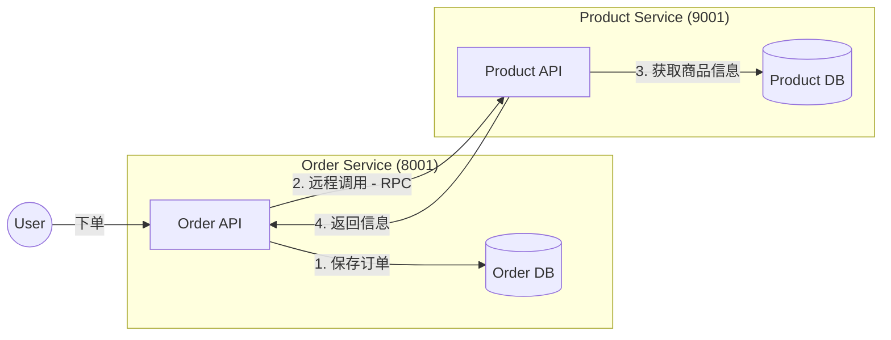

### 计划
1.  **设置数据库**: 为 Order 和 Product 服务创建 Schema。
2.  **共享模块**: 创建 `rainy-common` 来保存共享实体 (POJO)。
3.  **实现 RPC**: 使用 `RestTemplate` + `DiscoveryClient` (手动负载均衡) 从 Order Service 调用 Product Service。

### 实现总结 (关键点)
我们实现了一个 **手动的远程过程调用 (RPC)** 来连接服务。

**目标**: `Order Service` 需要与 `Product Service` 对话以获取商品详情（价格、名称）。

**“简单”方法 (当前实现)**:
我们没有使用 OpenFeign (尚未连接)，而是手动实现以理解核心概念：
1.  **发现**: 我们使用 `DiscoveryClient` 询问 Nacos：“谁在处理 'service-product'？”
2.  **选择**: 我们盲目地选择了 **第一个可用实例** (`instances.get(0)`)。
3.  **调用**: 我们构建了一个 URL (`http://ip:port/api/product/{id}`) 并使用 `RestTemplate` 发送 GET 请求。

**代码片段 (`OrderServiceImpl.java`)**:
```java
// 1. 询问 Nacos 获取 "service-product" 实例
List<ServiceInstance> instances = discoveryClient.getInstances("service-product");

// 2. 选择第一个 (手动负载均衡策略: First Available)
ServiceInstance instance = instances.get(0);

// 3. 构建 URL 并调用
String url = String.format("http://%s:%s/api/product/%s", instance.getHost(), instance.getPort(), productId);
Product product = restTemplate.getForObject(url, Product.class);
```
*这是微服务在添加 LoadBalancer 或 Feign 等魔法之前的其础“胶水”。*

### 数据库设置
运行以下 SQL 脚本初始化数据库。
**注意**: 我们有意 **避免外键** 以保持微服务解耦和高性能。逻辑在应用层处理。

#### 商品服务数据库 (`rainy_product`)

```sql
CREATE DATABASE IF NOT EXISTS rainy_product;
USE rainy_product;

CREATE TABLE t_product (
    id BIGINT PRIMARY KEY AUTO_INCREMENT COMMENT 'Product ID',
    name VARCHAR(255) NOT NULL COMMENT 'Product Name',
    price DECIMAL(10, 2) NOT NULL COMMENT 'Current Price',
    stock INT NOT NULL COMMENT 'Remaining Inventory',
    INDEX idx_name (name)
) COMMENT 'Product Master Catalog';
```

#### 订单服务数据库 (`rainy_order`)

```sql
CREATE DATABASE IF NOT EXISTS rainy_order;
USE rainy_order;

CREATE TABLE t_order (
    id BIGINT PRIMARY KEY AUTO_INCREMENT COMMENT 'Order ID',
    user_id BIGINT COMMENT 'User ID',
    nick_name VARCHAR(255) COMMENT 'User Nickname',
    address VARCHAR(255) COMMENT 'Shipping Address',
    total_amount DECIMAL(10, 2) COMMENT 'Total Order Cost',
    INDEX idx_user_id (user_id)
) COMMENT 'Order Header';

CREATE TABLE t_order_item (
    id BIGINT PRIMARY KEY AUTO_INCREMENT,
    order_id BIGINT NOT NULL COMMENT 'Links to t_order.id',
    product_id BIGINT NOT NULL COMMENT 'Links to t_product.id',
    product_name VARCHAR(255) COMMENT 'Snapshot of name',
    product_price DECIMAL(10, 2) COMMENT 'Snapshot of price',
    num INT NOT NULL COMMENT 'Quantity',
    INDEX idx_order_id (order_id),
    INDEX idx_product_id (product_id)
) COMMENT 'Order Items (No Foreign Keys)';
```

### 模拟数据
插入一些初始数据到商品服务，以便稍后测试 RPC 调用。

```sql
USE rainy_product;

INSERT INTO t_product (name, price, stock) VALUES 
('Rainy Cloud Umbrella', 99.00, 100),
('Spring Boot Mug', 25.50, 500),
('Java 17 Sticker', 5.00, 1000);
```

### 理解订单创建逻辑
当用户下单时（例如 `POST /api/order/create?userId=1&productId=2`），后台发生以下情况。
**注意**: 我们使用 `MyBatis-Plus` 来简化数据库交互。

#### 1. 逻辑流程
1.  **接收请求**: `OrderController` 接收 `userId` 和 `productId`。
2.  **远程调用 (RPC)**: `OrderService` 询问 `ProductService` 关于 `productId` 的价格。
3.  **计算总价**: 价格 * 1 (简单示例)。
4.  **保存订单**: 向 `t_order` 插入一行。
    *   *魔法*: MyBatis-Plus 在插入后自动填充 `order.id` 为新的数据库 ID（例如 5001）。
5.  **保存明细**: 使用新的 `order.id` 向 `t_order_item` 插入一行以链接它们。

#### 2. 幕后 (SQL)
这是典型事务生成的 SQL 样子：

**步骤 A: 获取商品 (RPC 调用)**
*由商品服务执行*
```sql
SELECT id, name, price, stock FROM t_product WHERE id = 2;
```

**步骤 B: 保存订单头**
*由订单服务执行*
```sql
INSERT INTO t_order (user_id, nick_name, total_amount, address) 
VALUES (1, 'RainyUser', 25.50, 'Cloud City');
```
*MyBatis-Plus 自动获取新 `id` (例如 `5001`)。*

**步骤 C: 保存订单明细**
*由订单服务执行*
```sql
INSERT INTO t_order_item (order_id, product_id, product_name, product_price, num) 
VALUES (5001, 2, 'Spring Boot Mug', 25.50, 1);
```

#### 3. 代码结构 (MyBatis-Plus)

**实体**
这些类直接映射到你的数据库表。

```java
@Data
@TableName("t_order")
public class Order {
    @TableId(type = IdType.AUTO)
    private Long id;
    private Long userId;
    private String nickName;
    private BigDecimal totalAmount;
    
    // 不在数据库表中，但对 JSON 响应很有用！
    @TableField(exist = false)
    private List<Product> productList;
}
```

**Mapper**
处理 SQL 执行的接口。通过继承 `BaseMapper<T>`，你将获得即时的 CRUD 能力。

**1. ProductMapper**
```java
@Mapper
public interface ProductMapper extends BaseMapper<Product> {
    // 继承的方法:
    // int insert(Product entity);
    // Product selectById(Serializable id);
    // int updateById(Product entity);
    // int deleteById(Serializable id);
    // ... 还有更多！
}
```

**2. OrderMapper (带自定义 SQL)**
如果内置方法不够用，你可以轻松编写自己的 SQL。

```java
@Mapper
public interface OrderMapper extends BaseMapper<Order> {
    
    // 示例: 使用注解的自定义 SQL
    @Select("SELECT * FROM t_order WHERE user_id = #{userId}")
    List<Order> findByUserId(Long userId);
}
```

**3. OrderItemMapper**
```java
@Mapper
public interface OrderItemMapper extends BaseMapper<OrderItem> {
    // 标准用法留空即可！
}
```

#### 4. 响应示例
在成功 `POST /api/order/create?userId=1&productId=2&count=3` 后，你将收到类似以下的 JSON 响应：

```json
{ 
  "id": 14, 
  "userId": 1, 
  "nickName": "DIO", 
  "address": "Cairo, Egypt", 
  "totalAmount": 76.50, 
  "productList": [ 
    { 
      "id": 2, 
      "name": "Spring Boot Mug", 
      "price": 25.50, 
      "stock": 500,
      "num": 3 
    } 
  ] 
}
```

## 4. 负载均衡

### 为什么？
在真实生产环境中，你可能会运行多个 `service-product` 实例（例如在端口 9001, 9002, 9003）以处理高流量。如果 `service-order` 硬编码 URL 为 `http://localhost:9001`，则失去了集群的意义。我们需要一种方法在所有可用实例之间分发请求。

### 依赖
自 Spring Cloud 2020.0 起，旧的 Netflix Ribbon 已被移除。我们现在使用 **Spring Cloud LoadBalancer**。

确保 `service-order/pom.xml` 包含：
```xml
<dependency>
    <groupId>org.springframework.cloud</groupId>
    <artifactId>spring-cloud-loadbalancer</artifactId>
</dependency>
```

### 方法 1: `LoadBalancerClient` (手动)
这是“底层”方式。你显式地要求负载均衡器为你选择一个服务实例。

```java
@Autowired
private LoadBalancerClient loadBalancerClient;

public void callService() {
    // 1. 要求负载均衡器选择一个 'service-product' 实例
    ServiceInstance instance = loadBalancerClient.choose("service-product");
    
    // 2. 使用选定实例的 IP 和端口构建 URL
    String url = String.format("http://%s:%s/api/product/%s", instance.getHost(), instance.getPort(), 1);
    
    // 3. 发起调用
    restTemplate.getForObject(url, Product.class);
}
```

### 方法 2: `@LoadBalanced` 注解 (推荐 ★)
这是标准、最便捷的方式。Spring 会向你的 `RestTemplate` 注入一个拦截器，自动将服务名解析为 IP。

**1. 配置 RestTemplate**
将 `@LoadBalanced` 添加到你的 Bean 定义中。

```java
@Configuration
public class OrderConfig {
    @Bean
    @LoadBalanced // <--- 魔法注解
    public RestTemplate restTemplate() {
        return new RestTemplate();
    }
}
```

**2. 在 URL 中使用服务名**
现在，不再使用 `localhost:9001`，而是使用 Nacos 中注册的 **服务名** (`service-product`)。

```java
// URL 现在与主机无关！
String url = "http://service-product/api/product/" + productId;
Product product = restTemplate.getForObject(url, Product.class);
```

**工作原理:**
1. Spring 看到 `http://service-product/api/product/...`。
2. `LoadBalancerInterceptor` 暂停请求。
3. 它询问负载均衡器：“给我一个 'service-product' 的实例”。
4. 它将 URL 重写为 `http://192.168.1.5:9001/api/product/...` 并让请求继续。

### 客户端 vs 服务端负载均衡

**客户端负载均衡**
- 调用者解析服务实例并选择一个进行调用。
- 通常配合注册中心 (Nacos) 和客户端库 (Spring Cloud LoadBalancer)。
- 在本项目中：`RestTemplate` + `@LoadBalanced` 调用 `http://service-product/api/product/...`，或者 Feign 使用 `name = "service-product"`（启用 Feign 后）。

**服务端负载均衡**
- 调用者将流量发送到单个端点 (VIP / 网关 / DNS 名称)。
- 负载均衡器将流量路由到其背后的实例 (Nginx/HAProxy, 云 LB, Kubernetes Service, API 网关)。
- 第三方 API 的典型做法：你调用 `https://api.vendor.com/...`，供应商进行负载均衡。

### 缓存机制 (重要)
客户端维护服务注册表（“电话簿”）的 **本地缓存**。

1.  **首次调用**: 客户端从 Nacos 拉取可用实例列表并在本地缓存。
2.  **后续调用**: 客户端使用 **本地缓存** 选择实例（负载均衡），避免每次请求都进行网络往返 Nacos。
3.  **后台更新**: 缓存会定期更新以反映变化（例如新实例或崩溃）。
4.  **弹性**: 如果 Nacos 宕机，你的服务 **仍然可以通信**，因为它们依赖本地缓存！

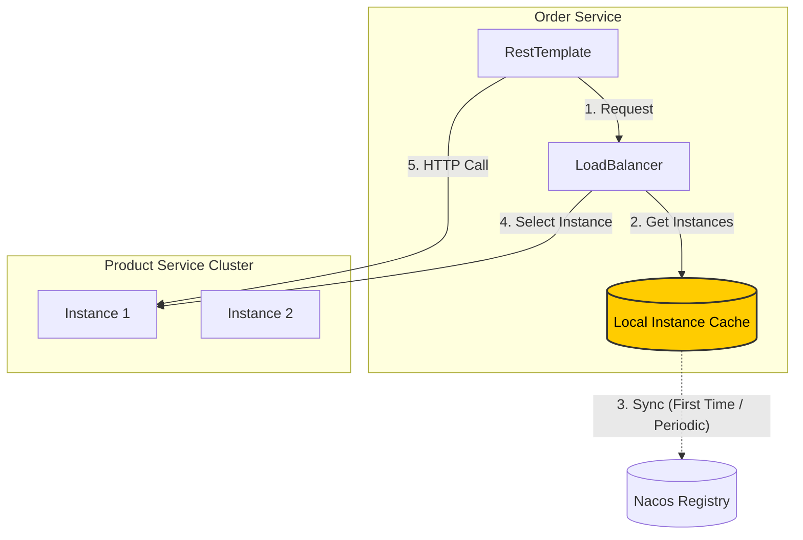

## 5. 分布式配置 (Nacos Config)

### 是什么 & 为什么
**概念**: 将配置文件（如 `application.properties`）集中在服务器 (Nacos) 中，而不是硬编码在每个服务中。
**重要性**:
1.  **动态更新**: 随时更改配置而无需重启服务。
2.  **集中管理**: 在一处查看和管理所有配置。

### 实现状态
目前，**Service Order** 已完全配置为使用 Nacos Config。

### 如何使用

#### 1. 添加依赖
`service-order/pom.xml`:
```xml
<dependency>
    <groupId>com.alibaba.cloud</groupId>
    <artifactId>spring-cloud-starter-alibaba-nacos-config</artifactId>
</dependency>
```

#### 2. 配置导入 (Spring Boot 2.4+)
`service-order/src/main/resources/application.properties`:
```properties
# 告诉 Spring 从 Nacos 加载配置
spring.config.import=nacos:service-order.properties

# 你也可以指定分组:
# spring.config.import=nacos:service-order.properties?group=DEFAULT_GROUP
```

#### 3. 在 Nacos 中创建配置
1.  进入 Nacos 控制台: `http://localhost:8080/nacos` -> **配置管理** -> **配置列表**。
2.  点击 **+** (创建)。
3.  **Data ID**: `service-order.properties` (必须匹配上面的导入)。
4.  **Group**: `DEFAULT_GROUP`。
5.  **配置内容**:
    ```properties
    order.timeout=300min
    order.auto-confirm=7d
    ```
    6.  点击 **发布**。

#### 4. 动态刷新 (推荐: `@ConfigurationProperties`)
我们从 `OrderController` 暴露 `/config` 并通过 `@ConfigurationProperties` (`OrderServiceProperties`) 绑定 Nacos 配置。这保持了 Controller 的整洁并避免了 `@Value` 的使用。

```java
@RestController
public class OrderController {
    
    // ...
}
```

#### 5. 替代方案 (推荐 ★): Configuration Properties
与其在每个 Controller 上使用 `@Value`，不如使用类型安全的 Configuration Properties 类。

**好处**:
- 不需要特殊的 Controller 注解；`@ConfigurationProperties` 提供清晰、类型化的配置视图。
- 强类型和验证。

**1. 定义 Properties 类**
`OrderServiceProperties.java`:
```java
@Component
@ConfigurationProperties(prefix = "order")
@Data
public class OrderServiceProperties {
    private String timeout;
    private String autoConfirm;
}
```

**2. 注入并使用**
`OrderController.java`:
```java
@RestController
@RequiredArgsConstructor
public class OrderController {
    
    private final OrderServiceProperties orderServiceProperties;

    @GetMapping("/config")
    public String getConfig() {
        return orderServiceProperties.toString();
    }
}
```

#### 6. 验证
访问 `http://localhost:8001/api/order/config`。你应该能看到来自 Nacos 的值。在 Nacos 控制台修改并刷新页面（无需重启！）。

#### 7. 配置优先级
如果本地和 Nacos 有相同的键，**Nacos 胜出**。

**优先级顺序 (高到低)**:
1.  **命令行参数** (`--server.port=9000`)
2.  **Nacos 配置** (远程)
3.  **本地 `application.properties`** (Jar 包内)

#### 8. 多环境支持 (Namespace)
Nacos 提供 **Namespace** 来隔离环境（开发、测试、生产）。

1.  **创建 Namespace**: 在 Nacos 控制台 -> **命名空间** -> **新建命名空间**。
    *   名称: `dev`
    *   ID: (自动生成的 UUID, 例如 `54e2...`)
2.  **配置客户端**:
    `application.properties`:
    ```properties
    spring.cloud.nacos.config.namespace=54e2... (粘贴 UUID)
    ```
3.  **克隆配置**: 你可以在控制台中将配置从 `public` 克隆到 `dev`。

#### 9. 高级组织 (Namespace > Group > Data ID)
把它想象成文件系统：
*   **Namespace**: 文件夹 (Dev, Prod)
*   **Group**: 子文件夹 (例如 `ORDER_GROUP`, `PRODUCT_GROUP` - 区分不同团队/模块)
*   **Data ID**: 文件名 (`service-order.properties`)

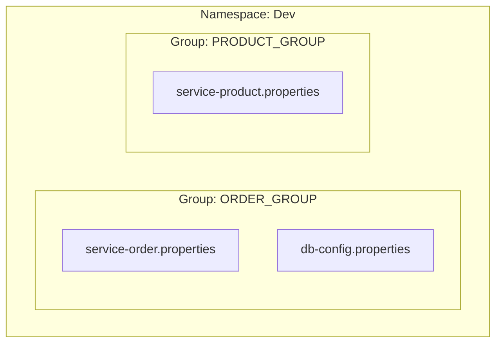

#### 10. 单文件多 Profile (YAML)
如果你更喜欢将所有内容保存在一个 `bootstrap.yml` 或 `application.yml` 中并切换 Profile：

`application.yml`:
```yaml
spring:
  profiles:
    active: dev
  config:
    import:
      - nacos:service-order-dev.yml # 显式指定
```

或者更简单：
`spring.config.import=nacos:service-order.yml`
Nacos 会自动查找 `service-order.yml` **和** `service-order-{profile}.yml`。

#### 11. 加载多个配置
你可以同时加载共享配置（如数据库设置）和服务特定配置。

```properties
spring.config.import=nacos:service-order.properties, nacos:db-shared.properties?group=COMMON_GROUP
```

#### 12. 编程式监听 (高级)
你可以在 Java 代码中监听配置变更。

```java
@Bean
public ApplicationRunner nacosConfigListener(NacosConfigManager nacosConfigManager) {
    return args -> {
        ConfigService configService = nacosConfigManager.getConfigService();
        configService.addListener("service-order.properties", "DEFAULT_GROUP", new Listener() {
            @Override
            public void receiveConfigInfo(String configInfo) {
                System.out.println("Config Changed: " + configInfo);
            }
            // ...
        });
    };
}
```

## 6. OpenFeign (声明式 RPC)

### 是什么 & 为什么
**概念**: OpenFeign 是一个声明式的 Web Service 客户端。它使编写 Web Service 客户端变得更容易。
**区别**:
*   **RestTemplate**: 命令式。你需要构建 URL、设置 Header 并执行。
*   **Feign**: 声明式。你定义一个接口，Feign 生成实现。

### 设置

#### 1. 依赖
`service-order/pom.xml`:
```xml
<dependency>
    <groupId>org.springframework.cloud</groupId>
    <artifactId>spring-cloud-starter-openfeign</artifactId>
</dependency>
```

#### 2. 开启 Feign
`OrderMainApplication.java`:
```java
@EnableFeignClients
@SpringBootApplication
public class OrderMainApplication { ... }
```

#### 3. 定义客户端接口
`ProductFeignClient.java`:
```java
// "service-product" 是 Nacos 中的应用名
@FeignClient(name = "service-product") 
public interface ProductFeignClient {
    
    // 匹配 Product Service 中的 Controller 方法签名
    @GetMapping("/api/product/{id}")
    Product getProductById(@PathVariable("id") Long id);
}
```

#### 4. 使用它
`OrderServiceImpl.java`:
```java
@Autowired
private ProductFeignClient productFeignClient;

public Product getProduct(Long id) {
    // 看起来像本地方法调用！
    return productFeignClient.getProductById(id);
}
```

### 与 LoadBalancer 集成
OpenFeign **自动集成** 了 Spring Cloud LoadBalancer。当你使用 `@FeignClient(name = "service-product")` 时，它会：
1.  在 Nacos 中查找 `service-product`。
2.  使用负载均衡器选择一个实例。
3.  发送请求。

### 高级用法

#### 5. 调用第三方 API (无服务发现)
你可以通过指定 `url` 使用 Feign 调用外部 API（如 Google、天气 API）。

```java
@FeignClient(name = "weather-client", url = "https://api.weather.com")
public interface WeatherClient {
    @GetMapping("/current")
    String getWeather();
}
```

#### 6. 超时控制
默认情况下，Feign (及底层客户端) 有超时限制。你可以在 `application.properties` 中配置它们。

```properties
# 连接超时: 建立连接的时间
spring.cloud.openfeign.client.config.default.connect-timeout=5000
# 读取超时: 等待响应的时间
spring.cloud.openfeign.client.config.default.read-timeout=5000
```

**细粒度控制**:
你可以为特定客户端设置超时：
```properties
spring.cloud.openfeign.client.config.service-product.read-timeout=2000
```

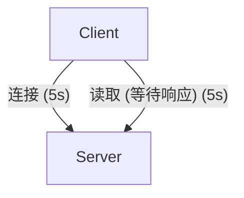

#### 7. 重试机制
Feign 会重试失败的请求吗？

**默认行为**:
默认情况下，OpenFeign 使用 `Retryer.NEVER_RETRY`。这意味着如果调用失败（例如超时或网络错误），它会立即抛出异常而不重试。

**如何开启 (不推荐用于所有情况)**:
你可以通过定义 `Retryer` Bean 来开启。

```java
@Bean
public Retryer feignRetryer() {
    // period=100ms, maxPeriod=1s, maxAttempts=3
    return new Retryer.Default(100, 1000, 3);
}
```

**常见实践: 我们应该使用吗？**

*   **幂等性很重要**:
    *   ✅ **安全重试**: 幂等操作，如 `GET` (读取数据) 或 `PUT` (更新整个资源)。
    *   ❌ **危险**: 非幂等操作，如 `POST` (创建订单)。重试超时的 `POST` 请求可能会导致重复订单，如果服务器实际上处理了第一个请求但响应丢失了。
*   **推荐**:
    *   保持 Feign 的默认 `NEVER_RETRY`。
    *   使用 **Resilience4j** (熔断器) 进行更细粒度的控制。它比 Feign 简单的重试器更健壮地处理重试、降级和熔断。

#### 8. 请求拦截器

**是什么 & 为什么**:
拦截器允许你在发送请求 **之前** 修改请求模板。这对于横切关注点至关重要，例如：
- **认证**: 向每个传出调用添加 `Authorization` Header（例如 JWT Token）。
- **日志**: 添加关联 ID。
- **定制**: 动态修改 URL 参数。

**实现示例**:
创建一个实现 `RequestInterceptor` 的 Bean。

```java
@Bean
public RequestInterceptor requestInterceptor() {
    return template -> {
        // 向每个请求添加自定义 Header
        template.header("X-Token", "SECRET-123");
        
        // 记录请求
        System.out.println("Intercepted Feign Request: " + template.url());
    };
}
```

**拦截流程**:

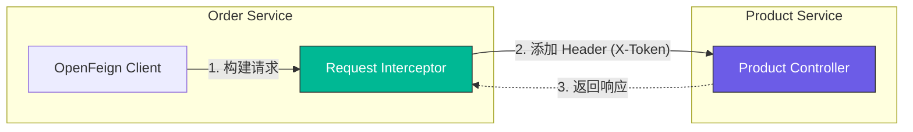

#### 9. 降级 (预览)

**是什么 & 为什么**:
当远程服务失败（超时、错误或宕机）时，**降级** 提供默认值或替代逻辑，防止故障级联到用户。

**实现**:
1.  创建一个实现 Feign 接口 (`ProductFeignClient`) 的类。
2.  用 `@Component` 注解它。
3.  在 `@FeignClient` 中链接它。

```java
// 1. 定义降级
@Component
public class ProductFeignClientFallback implements ProductFeignClient {
    @Override
    public Product getProductById(Long id) {
        // 返回虚拟数据或安全默认值
        return new Product(-1L, "默认商品 (服务宕机)", BigDecimal.ZERO, 0);
    }
}

// 2. 在 Client 中链接
@FeignClient(name = "service-product", fallback = ProductFeignClientFallback.class)
public interface ProductFeignClient { ... }
```

**⚠️ 重要提示: Sentinel 集成**
仅定义 `fallback` 类 **不会自动工作** 于 Spring Cloud Alibaba 的熔断，除非存在并启用了熔断器实现。

在这个技术栈中，**Sentinel** 是标准解决方案。
*   **没有 Sentinel**: 降级可能仅在特定异常（如 IO 错误）时触发，但不会提供真正的熔断（N 次失败后停止调用）。
*   **有 Sentinel**: 我们获得完整的流量控制、降级和熔断能力。

*我们将在下一章探索 Sentinel 以完全激活此功能。*

## 7. Sentinel (流量控制 & 可靠性)

### 是什么 & 为什么
Sentinel 是微服务的强大“流量卫士”。随着服务通信，稳定性变得至关重要。Sentinel 通过 **流量控制**、**熔断降级**、**系统自适应保护** 和 **热点流量控制** 保护你的系统免受级联故障的影响。

### 架构
Sentinel 以客户端-服务器模式运行：
*   **Sentinel Client (你的应用)**: 集成到微服务中 (Web, Dubbo, OpenFeign)。它向 Dashboard 报告指标并拉取规则。
*   **Sentinel Dashboard**: 一个 Web 控制台，用于查看实时指标并动态配置规则。
*   **规则存储**: 规则被推送到客户端。对于生产环境，它们应持久化到 Nacos/Zookeeper (推送模式)。

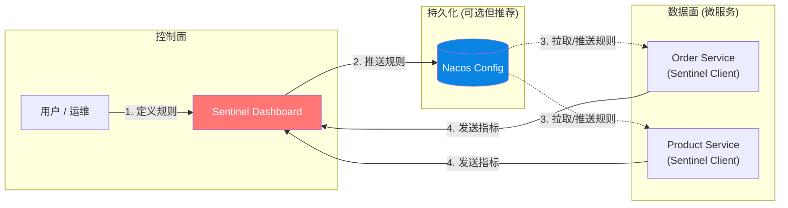

### 核心概念: 资源 & 规则

1.  **资源**: 任何你想保护的东西。
    *   **自动适配**: Web API (`/api/order/create`), Dubbo 方法, Feign 客户端。
    *   **手动**: 用 `@SentinelResource` 包裹的代码块。
2.  **规则**: 应用于资源的策略。
    *   **流量控制 (`FlowRule`)**: 限制 QPS (例如最大 10 req/s)。
    *   **降级 (`DegradeRule`)**: 熔断 (如果错误率 > 50% 或 RT > 500ms 则停止调用)。
    *   **系统保护 (`SystemRule`)**: 基于 CPU/Load 进行保护。
    *   **热点 (`ParamFlowRule`)**: 限制特定参数 (例如限制 `productId=123`)。

### 工作流程

每个请求都会经过一系列插槽 (Processors)。

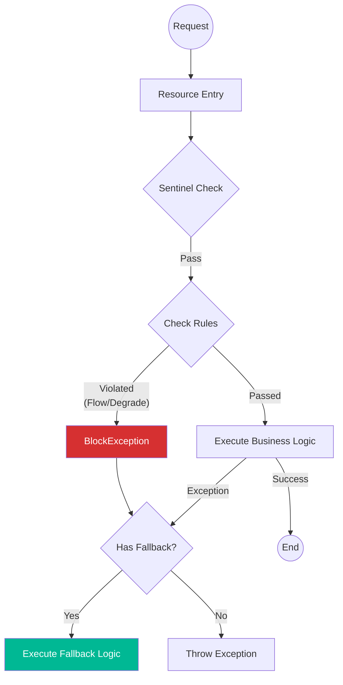

### Dashboard 设置

1.  **下载**: 从 [GitHub Releases](https://github.com/alibaba/Sentinel/releases) 获取 `sentinel-dashboard-1.8.9.jar` (或最新版)。
2.  **运行**:
    ```bash
    java -Dserver.port=8859 -jar sentinel-dashboard-1.8.9.jar
    ```
3.  **访问**: `http://localhost:8859` (用户名/密码: `sentinel` / `sentinel`)。

### 快速开始: 流量控制测试

我们用 `@SentinelResource` 保护了订单创建逻辑。

**1. 代码设置 (`OrderServiceImpl.java`)**:
```java
@SentinelResource(value = "createOrder") // 定义资源名
@Override
public Order createOrder(...) {
    // ...
}
```

**2. 注册资源**:
Sentinel 是懒加载的。你必须触发一次端点才能在 Dashboard 中看到它。
```bash
curl -X POST "http://localhost:8001/api/order/create?userId=1&productId=1&count=1"
```

**3. 配置规则**:
1.  进入 Dashboard -> **service-order** -> **流控规则**。
2.  点击 **+ 新增流控规则**。
3.  **资源名**: `createOrder`。
4.  **QPS 阈值**: `1`。
5.  点击 **新增**。

**4. 验证阻塞**:
疯狂发送请求（超过每秒 1 次）。

**结果**:
你会看到默认的阻塞信息：
> BlockedbySentinel(flowlimiting)

## 8. 网关 (Gateway)

### 是什么 & 为什么
API 网关充当所有客户端的单一入口点。客户端不直接调用单个服务（Order, Product），而是向网关发送请求，网关将请求路由到适当的服务。

**主要功能**:
1.  **统一入口**: 所有微服务的单一访问点。
2.  **请求路由**: 根据路径或其他标准将请求路由到正确的服务。
3.  **负载均衡**: 在服务实例之间分配流量。
4.  **流量控制**: 速率限制和流量控制。
5.  **身份认证**: 集中式认证验证。
6.  **协议转换**: 协议转换（例如 HTTP 到 RPC）。
7.  **系统监控**: 可观测性和日志记录。
8.  **安全保护**: 防火墙、IP 白名单等。

### 架构

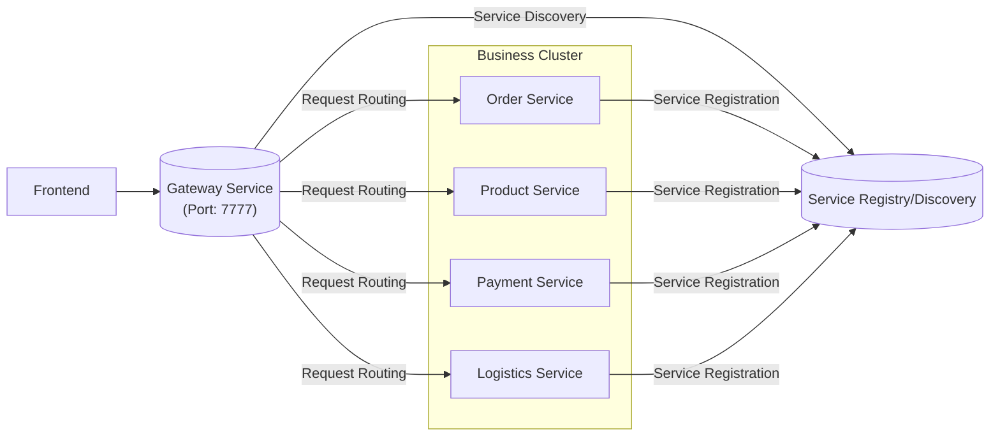

### 技术选择: Reactive vs MVC

我们选择了 **Spring Cloud Gateway (Reactive)** 而不是 MVC 变体，因为它在处理高并发时效率更高。

*   **Reactive (WebFlux)**: 基于 Project Reactor 和 Netty 构建。使用非阻塞、事件循环模型。非常适合 IO 密集型任务（如路由），允许它用更少的线程处理更多并发请求。
*   **MVC (Servlet)**: 基于传统的 Servlet API 构建。使用阻塞、每请求一线程模型。

**依赖的重要提示**:
从最近的 Spring Cloud 版本开始，Artifact 名称变得更加明确。
> `spring-cloud-starter-gateway` 已弃用。请使用 `spring-cloud-starter-gateway-server-webflux` 代替。

我们在 `gateway/pom.xml` 中显式使用 WebFlux starter：
```xml
<dependency>
    <groupId>org.springframework.cloud</groupId>
    <artifactId>spring-cloud-starter-gateway-server-webflux</artifactId>
</dependency>
<dependency>
    <groupId>org.springframework.cloud</groupId>
    <artifactId>spring-cloud-starter-loadbalancer</artifactId>
</dependency>
```

**负载均衡器依赖**:
我们使用 `spring-cloud-starter-loadbalancer` 而不是裸的 `spring-cloud-loadbalancer`。Starter 确保所有必要的自动配置都存在，这是在 Gateway 路由中解析 `lb://` URI 所必需的。

**配置更新**:
使用新的 `gateway-server-webflux` starter，路由配置属性已移动。
*   **旧**: `spring.cloud.gateway.routes`
*   **新**: `spring.cloud.gateway.server.webflux.routes`

### 核心概念: 断言 (Predicates) & 过滤器 (Filters)

网关基于简单而强大的流程工作：**匹配 (Predicate) -> 处理 (Filter) -> 路由**。

*   **路由断言 (Route Predicate)**: 决定请求 *是否* 匹配路由的逻辑。
    *   *示例*: 路径 (`/api/**`), 方法 (`GET`), Header, Host 等。
*   **网关过滤器 (Gateway Filter)**: 应用于特定路由以修改请求或响应的逻辑。
    *   *示例*: `AddRequestHeader`, `StripPrefix`, `Retry`。
    *   *流程*: 过滤器在链中起作用。**Pre-filters** 在发送请求到下游服务之前运行。**Post-filters** 在收到响应后运行。
*   **全局过滤器 (Global Filter)**: 应用于 **所有** 路由的逻辑。
    *   *用例*: 日志, 指标, 认证。
*   **定制**: 你可以编写自己的 `GlobalFilter` 或 `GatewayFilterFactory` 来实现自定义业务逻辑。

有关内置断言和过滤器的完整列表，请参阅 [Spring Cloud Gateway 官方文档](https://docs.spring.io/spring-cloud-gateway/docs/current/reference/html/)。

### 跨域资源共享 (CORS)

**为什么在网关配置？**
浏览器强制执行同源策略。当你的前端（例如 `localhost:8080`）尝试调用你的 API（例如 `localhost:7777`）时，除非配置了 CORS，否则浏览器会阻止它。

在 **Gateway** 级别配置 CORS 是最佳实践，因为：
1.  **集中化**: 你在一处定义规则（允许的来源、方法、Header），而不是在每个微服务（Order, Product 等）中重复。
2.  **效率**: Gateway 处理预检 (`OPTIONS`) 请求，减轻业务服务的负担。

有关配置详情，请参阅 [CORS 配置文档](https://docs.spring.io/spring-cloud-gateway/docs/current/reference/html/#cors-configuration)。

## 9. 分布式事务 (Seata)

### 问题: 分布式世界中的本地事务

在我们当前的微服务架构中，每个服务使用 `@Transactional` 管理自己的数据库事务：

*   **Order Service**: 开启事务，创建订单，提交。
*   **Product Service**: 开启事务，扣减库存，提交。

**故障场景**:
想象 `createOrder` 中的以下流程：
1.  **Product Service** 通过 Feign 被调用。它成功扣减库存并提交其事务。
2.  **Order Service** 继续执行，但在提交其自己的事务 *之前* 遇到错误（例如意外崩溃或异常）。
3.  **结果**:
    *   Order Service **回滚** (未创建订单)。
    *   Product Service **已提交** (库存已扣减)。
    *   **数据不一致**: 我们丢失了库存但没有获得订单。

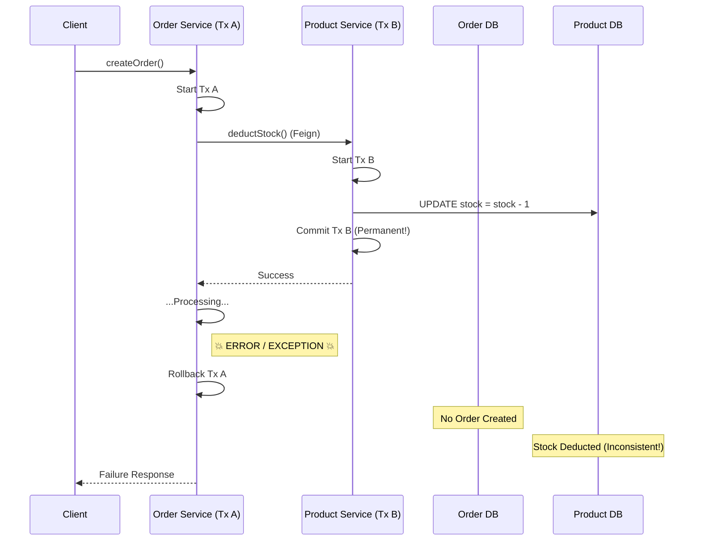

### 解决方案: 分布式事务管理器

为了解决这个问题，我们需要一种机制来确保 **要么全部** 服务提交，**要么全部** 回滚，从而保持分布式系统中的数据一致性。这就是 **Seata** 的用武之地。

#### Seata 如何工作

Seata 使用三角色架构来管理分布式事务：

1.  **TC (Transaction Coordinator, 事务协调者)**:
    *   **角色**: “老板”。一个独立的服务器（像 Nacos），维护全局事务和所有分支事务的状态。
    *   **职责**: 驱动全局提交或回滚。

2.  **TM (Transaction Manager, 事务管理器)**:
    *   **角色**: “请求者”。通常嵌入在发起流程的服务中（例如 Order Service）。
    *   **职责**: 定义全局事务的范围。它告诉 TC “开始”、“提交”或“回滚”全局事务。

3.  **RM (Resource Manager, 资源管理器)**:
    *   **角色**: “工人”。嵌入在每个接触数据库的服务中（例如 Order, Product, Account）。
    *   **职责**: 管理本地数据库资源。它向 TC 注册其分支事务并报告其状态（成功/失败）。

**工作流程**:
1.  **TM** 要求 **TC** 开启一个新的全局事务。
2.  **TM** 调用微服务 (即 **RM**)。
3.  每个 **RM** 执行其本地 SQL，但在提交之前，它向 **TC** 注册。
4.  如果任何 **RM** 失败，**TM** 告诉 **TC** 回滚。**TC** 随后指示所有 **RM** 撤销其更改。

### 将 Seata 映射到我们的架构

在我们的 `rainy-spring-cloud` 项目中，角色分配如下：

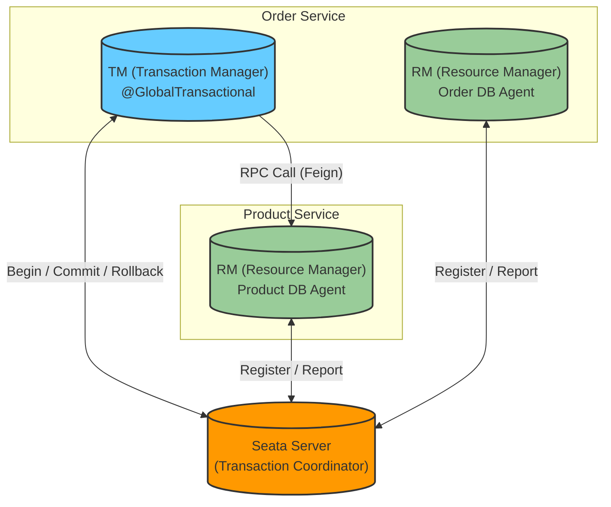

*   **TC**: 我们需要部署的独立 Seata Server。
*   **TM**: `Order Service` (具体是 `createOrder` 方法)，它发起全局事务。
*   **RM**: `Order Service` 和 `Product Service` 都是 RM，因为它们都与各自的数据库 (`rainy_order` 和 `rainy_product`) 交互。

更多详情请参阅 [Seata 官方文档](https://seata.apache.org/docs/overview/what-is-seata/)。

### 设置指南

#### 步骤 1: 检查版本
首先，检查你的 `spring-cloud-alibaba-dependencies` 中定义的 Seata 版本（通常在根 `pom.xml` 或继承的 BOM 中）。
> 对于本项目，Seata 版本是 **2.5.0**。

#### 步骤 2: Seata Server 设置
1.  **下载**: 从 [官方发布页面](https://github.com/apache/incubator-seata/releases) 下载 Seata Server 包。
2.  **启动**: 进入 `bin` 文件夹并运行启动脚本。
    ```bash
    ./seata-server.sh
    ```
    *   这将在 **后台** (nohup) 启动服务器。
    *   **端口**: 默认是 `8091`。
    *   **日志**: 查看 `nohup.out` 获取启动日志。
    *   **注意**: 新版本中端口 `7091` 的旧 Web UI 不再可用。
3.  **停止**: 要停止服务器，你需要手动 kill 进程（例如 `kill -9 <pid>`）。

#### 步骤 3: 客户端配置
要在微服务（Order, Product 等）中启用 Seata：

1.  **添加依赖**:
    在服务的 `pom.xml` 中添加 starter：
    ```xml
    <dependency>
        <groupId>com.alibaba.cloud</groupId>
        <artifactId>spring-cloud-starter-alibaba-seata</artifactId>
    </dependency>
    ```

2.  **配置**:
    虽然 Seata 支持 Nacos 进行配置管理（生产环境推荐），但为了简单起见，我们在每个服务的 `resources` 文件夹中使用本地 `file.conf`。

    **file.conf**:
    ```conf
    service {
      # 事务服务组映射
      # 格式: vgroupMapping.<TxServiceGroup> = "<SeataServerGroup>"
      vgroupMapping.default_tx_group = "default"
      
      # 仅当 registry.type=file 时支持
      default.grouplist = "127.0.0.1:8091"
      
      # 目前不支持降级
      enableDegrade = false
      
      # 禁用 Seata
      disableGlobalTransaction = false
    }
    ```

#### 步骤 4: 数据库设置 (AT 模式)
我们使用的是 **AT 模式** (Automatic Transaction)，它要求在 **每个** 微服务的数据库中有一个 `undo_log` 表来存储用于回滚的数据前/后镜像。

1.  **创建表**: 在 `rainy_order` 和 `rainy_product` 数据库中运行以下 SQL。
    *   [官方 undo_log SQL 脚本](https://seata.apache.org/docs/user/quickstart/?utm_source=chatgpt.com#step-2-create-undo_log-table)

    ```sql
    -- Standard Seata AT Mode Undo Log Table
    CREATE TABLE IF NOT EXISTS `undo_log` (
        `branch_id`     BIGINT       NOT NULL COMMENT 'branch transaction id',
        `xid`           VARCHAR(128) NOT NULL COMMENT 'global transaction id',
        `context`       VARCHAR(128) NOT NULL COMMENT 'undo_log context,such as serialization',
        `rollback_info` LONGBLOB     NOT NULL COMMENT 'rollback info',
        `log_status`    INT(11)      NOT NULL COMMENT '0:normal status,1:defense status',
        `log_created`   DATETIME(6)  NOT NULL COMMENT 'create datetime',
        `log_modified`  DATETIME(6)  NOT NULL COMMENT 'modify datetime',
        UNIQUE KEY `ux_undo_log` (`xid`, `branch_id`)
    ) ENGINE = InnoDB AUTO_INCREMENT = 1 DEFAULT CHARSET = utf8mb4 COMMENT ='AT transaction mode undo table';
    ```

#### 步骤 5: 开启全局事务
最后，用 `@GlobalTransactional` 注解你的业务入口点（事务管理器）。

**OrderServiceImpl.java**:
```java
    @GlobalTransactional // <--- 开启全局事务 (Seata)
    @Transactional       // <--- 仍然需要用于本地事务 (数据库)
    @SentinelResource(value = "createOrder", blockHandler = "createOrderFallback")
    @Override
    public Order createOrder(Long productId, Long userId, int count) {
        // ... 业务逻辑 ...
    }
```
*   **@GlobalTransactional**: 告诉 Seata 开启一个全局事务。如果任何参与者失败，Seata 协调全局回滚。
*   **@Transactional**: 确保本地数据库操作（例如插入订单）是本地事务的一部分。
*   **@SentinelResource**: 包装该方法以进行流量控制和熔断。

### Seata AT 模式如何工作

Seata AT 模式是一种非侵入式的分布式事务解决方案。它依赖于两阶段提交协议，但通过在阶段 1 **尽早** 提交本地事务（而不是持有数据库锁直到阶段 2）来优化性能。

#### 阶段 1: 执行 & 准备 (本地提交)
在此阶段，Seata 拦截你的业务 SQL 执行，以便在提交本地事务之前生成“Undo Log”。

1.  **解析 SQL**: Seata 分析你的 SQL（例如 `UPDATE storage_tbl SET count = count - 2 ...`）。
2.  **前镜像**: 在更新 **之前** 查询数据以保存原始状态。
3.  **执行 SQL**: 执行业务 SQL 更新数据库。
4.  **后镜像**: 在更新 **之后** 查询数据以保存新状态。
5.  **插入 Undo Log**: 向 `undo_log` 表插入一条包含两个镜像和全局事务 ID (XID) 的记录。
6.  **本地提交**: 在 **一个本地事务** 中提交业务 SQL 和 Undo Log 插入。
7.  **报告**: 向 TC (事务协调者) 报告分支状态。

#### 阶段 2: 全局提交或回滚
TC 根据所有分支的状态决定是提交还是回滚。

*   **场景 A: 全局提交 (全部成功)**
    1.  TC 通知 RM (资源管理器) **提交**。
    2.  RM 将任务放入异步队列。
    3.  **动作**: RM 简单地 **删除** `undo_log` 记录（因为数据已经提交）。
    4.  *效率*: 这非常快，因为不需要数据库回滚。

*   **场景 B: 全局回滚 (任何失败)**
    1.  TC 通知 RM **回滚**。
    2.  RM 使用 XID 和 Branch ID 找到对应的 `undo_log` 记录。
    3.  **验证**: 比较当前数据库数据与 **后镜像**。
        *   *为什么？* 确保自阶段 1 以来没有发生其他脏写。
    4.  **恢复**: 使用 **前镜像** 将数据恢复到原始状态。
    5.  **清理**: 删除 `undo_log` 记录。

#### 可视化 AT 协议

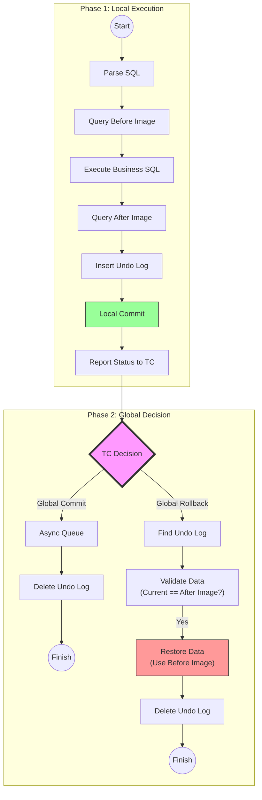

### 其他 Seata 模式 (简要比较)

除了 AT 模式（默认），Seata 还支持其他三种模式以应对不同场景：

1.  **TCC 模式 (Try-Confirm-Cancel)**
    *   **机制**: 你手动实现三个方法：`prepare` (Try), `commit` (Confirm), 和 `rollback` (Cancel)。
    *   **优点**: 高性能；不依赖数据库事务。
    *   **缺点**: 侵入式（需要编写大量代码）。
    *   **用例**: 高并发场景或资源不是数据库（例如 Redis）。

2.  **Saga 模式**
    *   **机制**: 一系列本地事务。如果一个失败，则按相反顺序执行补偿事务。
    *   **优点**: 处理长运行的业务流程；异步。
    *   **缺点**: 无隔离性（可能发生脏读）；复杂的补偿逻辑。
    *   **用例**: 遗留系统或长服务链。

3.  **XA 模式**
    *   **机制**: 数据库本身支持的标准 2PC 协议。
    *   **优点**: 强一致性；标准。
    *   **缺点**: 阻塞（锁定资源直到全局提交）；性能较低。
    *   **用例**: 需要严格 ACID 合规性的金融系统。

## 10. 完整系统架构

这是 `rainy-spring-cloud` 系统的“全景图”，集成了所有 9 个关键组件。

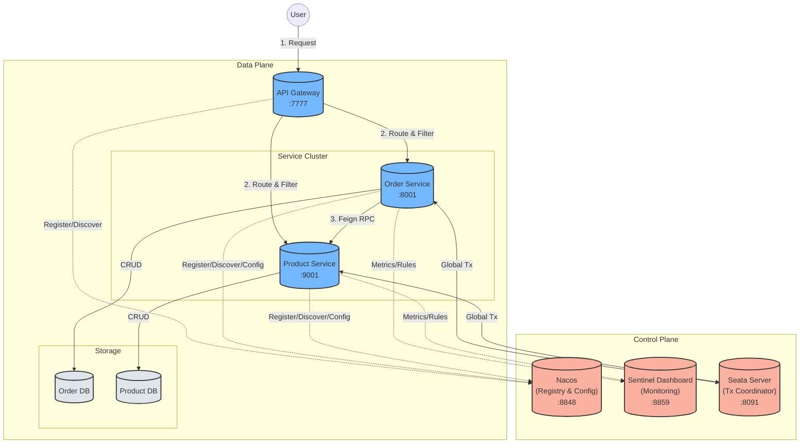

**组件总结**:
1.  **Nacos**: 大脑。处理服务注册（谁在哪里？）和配置（什么设置？）。
2.  **Sentinel**: 卫士。通过流量控制和熔断保护服务。
3.  **Seata**: 法官。确保分布式事务一致性（全提交或全回滚）。
4.  **Gateway**: 大门。统一入口点，路由和过滤。
5.  **Order Service**: 消费者。编排业务逻辑。
6.  **Product Service**: 提供者。管理库存。
7.  **OpenFeign**: 电话。使远程调用看起来像本地方法调用。
8.  **LoadBalancer**: 交通警察。在服务实例之间分发请求。
9.  **Database**: 金库。存储数据，支持 Seata `undo_log`。

## 模块

### 根配置

根 `pom.xml` 作为父项目，管理：
- **依赖版本**: 集中管理 Spring Boot (3.5.9), Spring Cloud (2025.0.1), 和 Spring Cloud Alibaba (2025.0.0.0) 的版本。
- **BOM (Bill of Materials)**: 导入 `spring-cloud-dependencies` 和 `spring-cloud-alibaba-dependencies` 以在模块间实现一致的依赖管理。

### 服务

`services` 模块作为系统中微服务的分组。

- **service-order**: 负责订单处理和管理。
- **service-product**: 负责商品目录和库存管理。

## API 参考

### 商品服务 (`service-product`)
Base URL: `http://localhost:9001` (或你配置的任何端口)

| 方法 | 端点 | 描述 | 参数 |
| :--- | :--- | :--- | :--- |
| `GET` | `/api/product/hello` | 健康检查 / 简单问候 | 无 |
| `GET` | `/api/product/{id}` | 通过 ID 获取商品详情 | `id` (Path Variable): 商品 ID |

### 订单服务 (`service-order`)
Base URL: `http://localhost:8001` (或你配置的任何端口)

| 方法 | 端点 | 描述 | 参数 |
| :--- | :--- | :--- | :--- |
| `POST` | `/api/order/create` | 创建新订单 | `userId` (Query): 用户 ID<br>`productId` (Query): 商品 ID<br>`count` (Query, 默认=1): 数量 |
| `GET` | `/api/order/config` | 从 Nacos 获取配置 | 无 |

## 故障排除

### MyBatis-Plus 依赖问题
如果遇到与 `SqlSessionFactory` 相关的 `UnsatisfiedDependencyException` 或 Bean 创建错误，请检查你的 `mybatis-plus` starter 版本。

**问题:** 在 Spring Boot 3.x 中使用 `mybatis-plus-spring-boot4-starter` 可能会导致兼容性问题。

**解决方案:** 对 Spring Boot 3 项目使用 `mybatis-plus-spring-boot3-starter` (或自动适配的标准 starter)。

```xml
<!-- Spring Boot 3 的正确依赖 -->
<dependency>
    <groupId>com.baomidou</groupId>
    <artifactId>mybatis-plus-spring-boot3-starter</artifactId>
    <version>3.5.15</version>
</dependency>
```

### Mapper 未找到
如果你的 Mapper 出现 `NoSuchBeanDefinitionException`:
1. 确保你的 Mapper 接口使用了 `@Mapper` 注解。
2. 或者在你的主应用类上使用 `@MapperScan("cc.rainyctl.services.*.mapper")`。

### Nacos Config Data ID
如果你的配置未被加载（例如值保持为 null 或默认值）：

**问题:** 你在 Nacos 中创建了 Data ID `service-order`，但你的应用期望有文件扩展名。

**解决方案:** Data ID **必须包含扩展名**。
*   **错误:** `service-order`
*   **正确:** `service-order.properties` (或 `.yaml` 如果使用 YAML)

这必须与你在 `spring.config.import` 中定义的匹配：
```properties
spring.config.import=nacos:service-order.properties
```

## 未来探索

我们目前为了简单起见，在 **单机模式** 下使用 Nacos 和嵌入式 **Derby** 数据库。然而，对于生产级环境，我们应该探索：

1.  **Nacos + MySQL**:
    *   默认情况下，Nacos 使用 Derby。切换到 MySQL 可确保数据持久性并允许更轻松地管理配置数据。
    *   需要执行 `nacos-mysql.sql` 并在 `custom.properties` 中设置 `spring.datasource.platform=mysql`。

2.  **Nacos 集群模式**:
    *   为了确保高可用性 (HA)，我们应该部署 Nacos 服务器集群（3+ 节点）。
    *   需要在集群前部署负载均衡器（如 Nginx）。
    *   配置 `cluster.conf` 包含所有节点的 IP:Port。

更多详情请参阅 [Nacos 官方文档](https://nacos.io/en-us/docs/cluster-mode-quick-start.html)。
