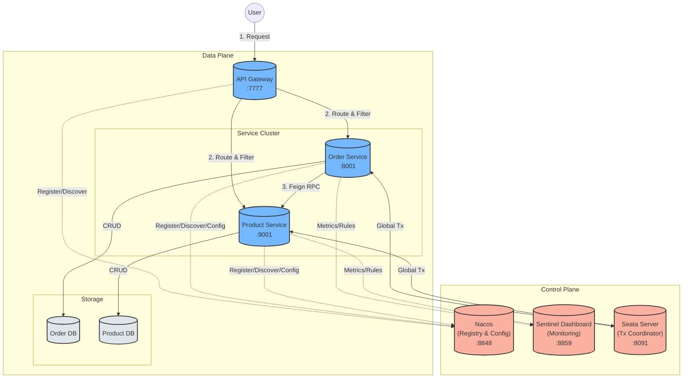

# Complete System Architecture

Here is the "Big Picture" of the `rainy-spring-cloud` system, integrating all 9 key components.

**Component Summary**:
1.  **Nacos**: The brain. Handles Service Registry (Who is where?) and Configuration (What settings?).
2.  **Sentinel**: The guard. Protects services with Flow Control and Circuit Breaking.
3.  **Seata**: The judge. Ensures Distributed Transaction consistency (All commit or All rollback).
4.  **Gateway**: The door. Unified entry point, routing, and filtering.
5.  **Order Service**: The consumer. Orchestrates business logic.
6.  **Product Service**: The provider. Manages inventory.
7.  **OpenFeign**: The phone. Makes remote calls look like local method calls.
8.  **LoadBalancer**: The traffic cop. Distributes requests among service instances.
9.  **Database**: The vault. Stores data with Seata `undo_log` support.
