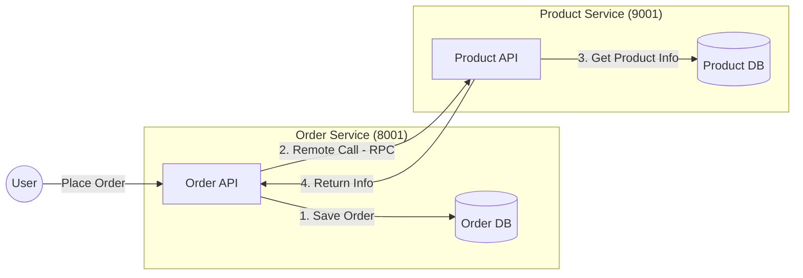

# 3. Remote Procedure Call (RPC)

### Architecture
We are building a system where the **Order Service** needs to fetch product details from the **Product Service**.



### Plan
1.  **Setup Database**: Create schema for Order and Product services.
2.  **Shared Module**: Create `rainy-common` to hold shared entities (POJOs).
3.  **Implement RPC**: Use `RestTemplate` + `DiscoveryClient` (Manual Load Balancing) to call Product Service from Order Service.

### Implementation Summary (Crux)
We implemented a **manual Remote Procedure Call (RPC)** to connect the services.

**The Goal**: `Order Service` needs to talk to `Product Service` to get product details (price, name).

**The "Simple" Approach (Current Implementation)**:
Instead of using OpenFeign (not wired yet), we did it manually to understand the core concept:
1.  **Discovery**: We used `DiscoveryClient` to ask Nacos: *"Who handles 'service-product'?"*
2.  **Selection**: We blindly picked the **first available instance** (`instances.get(0)`).
3.  **Call**: We constructed a URL (`http://ip:port/api/product/{id}`) and fired a GET request using `RestTemplate`.

**Code Snippet (`OrderServiceImpl.java`)**:
```java
// 1. Ask Nacos for "service-product" instances
List<ServiceInstance> instances = discoveryClient.getInstances("service-product");

// 2. Pick the first one (Manual Load Balancing strategy: First Available)
ServiceInstance instance = instances.get(0);

// 3. Build URL and call
String url = String.format("http://%s:%s/api/product/%s", instance.getHost(), instance.getPort(), productId);
Product product = restTemplate.getForObject(url, Product.class);
```
*This is the foundational "glue" of microservices before adding magic like LoadBalancer or Feign.*

### Database Setup
Run the following SQL scripts to initialize your database.
**Note**: We intentionally **avoid Foreign Keys** to keep microservices decoupled and performance high. Logic is handled in the application layer.

#### Product Service Database (`rainy_product`)

```sql
CREATE DATABASE IF NOT EXISTS rainy_product;
USE rainy_product;

CREATE TABLE t_product (
    id BIGINT PRIMARY KEY AUTO_INCREMENT COMMENT 'Product ID',
    name VARCHAR(255) NOT NULL COMMENT 'Product Name',
    price DECIMAL(10, 2) NOT NULL COMMENT 'Current Price',
    stock INT NOT NULL COMMENT 'Remaining Inventory',
    INDEX idx_name (name)
) COMMENT 'Product Master Catalog';
```

#### Order Service Database (`rainy_order`)

```sql
CREATE DATABASE IF NOT EXISTS rainy_order;
USE rainy_order;

CREATE TABLE t_order (
    id BIGINT PRIMARY KEY AUTO_INCREMENT COMMENT 'Order ID',
    user_id BIGINT COMMENT 'User ID',
    nick_name VARCHAR(255) COMMENT 'User Nickname',
    address VARCHAR(255) COMMENT 'Shipping Address',
    total_amount DECIMAL(10, 2) COMMENT 'Total Order Cost',
    INDEX idx_user_id (user_id)
) COMMENT 'Order Header';

CREATE TABLE t_order_item (
    id BIGINT PRIMARY KEY AUTO_INCREMENT,
    order_id BIGINT NOT NULL COMMENT 'Links to t_order.id',
    product_id BIGINT NOT NULL COMMENT 'Links to t_product.id',
    product_name VARCHAR(255) COMMENT 'Snapshot of name',
    product_price DECIMAL(10, 2) COMMENT 'Snapshot of price',
    num INT NOT NULL COMMENT 'Quantity',
    INDEX idx_order_id (order_id),
    INDEX idx_product_id (product_id)
) COMMENT 'Order Items (No Foreign Keys)';
```

### Mock Data
Insert some initial data into the Product Service so we can test the RPC call later.

```sql
USE rainy_product;

INSERT INTO t_product (name, price, stock) VALUES 
('Rainy Cloud Umbrella', 99.00, 100),
('Spring Boot Mug', 25.50, 500),
('Java 17 Sticker', 5.00, 1000);
```

### Understanding Order Creation Logic
When a user places an order (e.g., `POST /api/order/create?userId=1&productId=2`), the following happens behind the scenes.
**Note**: We use `MyBatis-Plus` to simplify database interactions.

#### 1. The Logic Flow
1.  **Receive Request**: `OrderController` receives `userId` and `productId`.
2.  **Remote Call (RPC)**: `OrderService` asks `ProductService` for the price of `productId`.
3.  **Calculate Total**: Price * 1 (simple example).
4.  **Save Order**: Insert a row into `t_order`.
    *   *Magic*: MyBatis-Plus automatically fills `order.id` with the new database ID (e.g., 5001) right after insertion.
5.  **Save Item**: Insert a row into `t_order_item` using that new `order.id` to link them.

#### 2. Behind the Scenes (SQL)
Here is what the generated SQL looks like for a typical transaction:

**Step A: Get Product (RPC Call)**
*Executed by Product Service*
```sql
SELECT id, name, price, stock FROM t_product WHERE id = 2;
```

**Step B: Save Order Header**
*Executed by Order Service*
```sql
INSERT INTO t_order (user_id, nick_name, total_amount, address) 
VALUES (1, 'RainyUser', 25.50, 'Cloud City');
```
*MyBatis-Plus automatically retrieves the new `id` (e.g., `5001`).*

**Step C: Save Order Item**
*Executed by Order Service*
```sql
INSERT INTO t_order_item (order_id, product_id, product_name, product_price, num) 
VALUES (5001, 2, 'Spring Boot Mug', 25.50, 1);
```

#### 3. Code Structure (MyBatis-Plus)

**Entities**
These classes map directly to your database tables.

```java
@Data
@TableName("t_order")
public class Order {
    @TableId(type = IdType.AUTO)
    private Long id;
    private Long userId;
    private String nickName;
    private BigDecimal totalAmount;
    
    // Not in DB table, but useful for JSON response!
    @TableField(exist = false)
    private List<Product> productList;
}
```

**Mappers**
Interfaces that handle the SQL execution. By extending `BaseMapper<T>`, you get instant CRUD powers.

**1. ProductMapper**
```java
@Mapper
public interface ProductMapper extends BaseMapper<Product> {
    // Inherited methods:
    // int insert(Product entity);
    // Product selectById(Serializable id);
    // int updateById(Product entity);
    // int deleteById(Serializable id);
    // ... and many more!
}
```

**2. OrderMapper (with Custom SQL)**
If the built-in methods aren't enough, you can write your own SQL easily.

```java
@Mapper
public interface OrderMapper extends BaseMapper<Order> {
    
    // Example: Custom SQL with annotation
    @Select("SELECT * FROM t_order WHERE user_id = #{userId}")
    List<Order> findByUserId(Long userId);
}
```

**3. OrderItemMapper**
```java
@Mapper
public interface OrderItemMapper extends BaseMapper<OrderItem> {
    // Just empty is fine for standard usage!
}
```

#### 4. Response Example
After a successful `POST /api/order/create?userId=1&productId=2&count=3`, you will receive a JSON response similar to this:

```json
{ 
  "id": 14, 
  "userId": 1, 
  "nickName": "DIO", 
  "address": "Cairo, Egypt", 
  "totalAmount": 76.50, 
  "productList": [ 
    { 
      "id": 2, 
      "name": "Spring Boot Mug", 
      "price": 25.50, 
      "stock": 500,
      "num": 3 
    } 
  ] 
}
```
