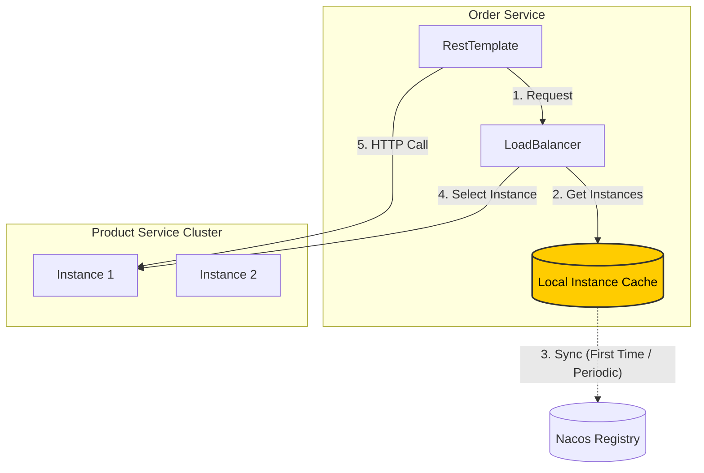

# 4. Load Balancing

### Why?
In a real production environment, you will likely have multiple instances of `service-product` running (e.g., on ports 9001, 9002, 9003) to handle high traffic. If `service-order` hardcodes the URL to `http://localhost:9001`, it defeats the purpose of clustering. We need a way to distribute requests across all available instances.

### Dependencies
Since Spring Cloud 2020.0, the old Netflix Ribbon has been removed. We now use **Spring Cloud LoadBalancer**.

Ensure `service-order/pom.xml` includes:
```xml
<dependency>
    <groupId>org.springframework.cloud</groupId>
    <artifactId>spring-cloud-loadbalancer</artifactId>
</dependency>
```

### Approach 1: `LoadBalancerClient` (Manual)
This is the "under-the-hood" way. You explicitly ask the Load Balancer to pick a service instance for you.

```java
@Autowired
private LoadBalancerClient loadBalancerClient;

public void callService() {
    // 1. Ask Load Balancer to choose an instance of 'service-product'
    ServiceInstance instance = loadBalancerClient.choose("service-product");
    
    // 2. Build the URL using the chosen instance's IP and Port
    String url = String.format("http://%s:%s/api/product/%s", instance.getHost(), instance.getPort(), 1);
    
    // 3. Make the call
    restTemplate.getForObject(url, Product.class);
}
```

### Approach 2: `@LoadBalanced` Annotation (Recommended ★)
This is the standard, most convenient way. Spring injects an interceptor into your `RestTemplate` that automatically resolves service names to IPs.

**1. Configure RestTemplate**
Add `@LoadBalanced` to your bean definition.

```java
@Configuration
public class OrderConfig {
    @Bean
    @LoadBalanced // <--- The Magic Annotation
    public RestTemplate restTemplate() {
        return new RestTemplate();
    }
}
```

**2. Use Service Name in URL**
Now, instead of `localhost:9001`, you use the **Service Name** (`service-product`) registered in Nacos.

```java
// The URL is now host-agnostic!
String url = "http://service-product/api/product/" + productId;
Product product = restTemplate.getForObject(url, Product.class);
```

**How it works:**
1. Spring sees `http://service-product/api/product/...`.
2. The `LoadBalancerInterceptor` pauses the request.
3. It asks the Load Balancer: "Give me an instance for 'service-product'".
4. It rewrites the URL to `http://192.168.1.5:9001/api/product/...` and lets the request proceed.

### Client-Side vs Server-Side Load Balancing

**Client-side load balancing**
- The caller resolves service instances and picks one to call.
- Usually paired with a registry (Nacos) and a client library (Spring Cloud LoadBalancer).
- In this project: `RestTemplate` + `@LoadBalanced` calling `http://service-product/api/product/...`, or Feign with `name = "service-product"` (after enabling Feign).

**Server-side load balancing**
- The caller sends traffic to a single endpoint (VIP / gateway / DNS name).
- A load balancer routes to instances behind it (Nginx/HAProxy, cloud LB, Kubernetes Service, API Gateway).
- Typical for third-party APIs: you call `https://api.vendor.com/...` and the vendor does the balancing.

### Caching Mechanism (Important)
The client maintains a **local cache** of the service registry (the "phonebook").

1.  **First Call**: The client pulls the list of available instances from Nacos and caches it locally.
2.  **Subsequent Calls**: The client uses the **local cache** to pick an instance (Load Balancing), avoiding a network trip to Nacos for every request.
3.  **Background Updates**: The cache is periodically updated to reflect changes (e.g., new instances or crashes).
4.  **Resilience**: If Nacos goes down, your services can **still communicate** because they rely on the local cache!


