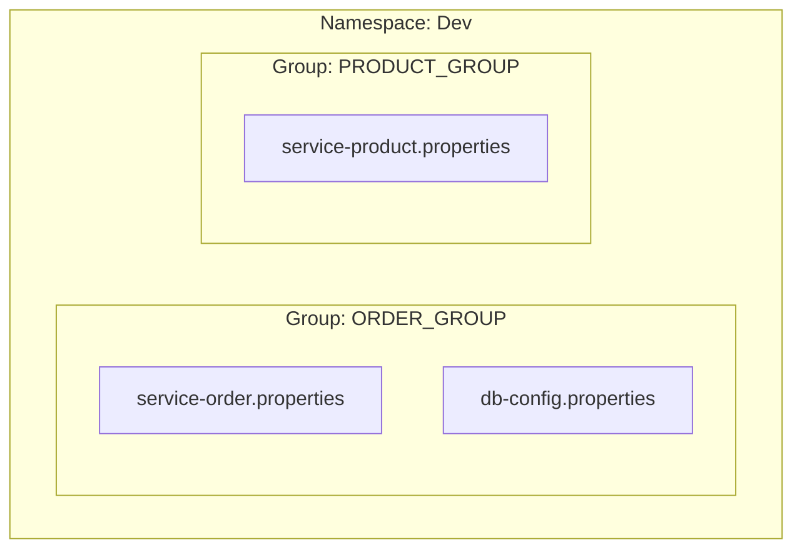

# 5. Distributed Configuration (Nacos Config)

### What & Why
**Concept**: Centralizing configuration files (like `application.properties`) in the server (Nacos) instead of hardcoding them in each service.
**Importance**:
1.  **Dynamic Updates**: Change config on the fly without restarting the service.
2.  **Central Management**: View and manage all configs in one place.

### Implementation Status
Currently, **Service Order** is fully configured to use Nacos Config.

### How to Use

#### 1. Add Dependency
`service-order/pom.xml`:
```xml
<dependency>
    <groupId>com.alibaba.cloud</groupId>
    <artifactId>spring-cloud-starter-alibaba-nacos-config</artifactId>
</dependency>
```

#### 2. Configure Import (Spring Boot 2.4+)
`service-order/src/main/resources/application.properties`:
```properties
# Tell Spring to load config from Nacos
spring.config.import=nacos:service-order.properties

# You can also specify the Group:
# spring.config.import=nacos:service-order.properties?group=DEFAULT_GROUP
```

#### 3. Create Config in Nacos
1.  Go to Nacos Console: `http://localhost:8080/nacos` -> **Config Management** -> **Configurations**.
2.  Click **+** (Create).
3.  **Data ID**: `service-order.properties` (Must match the import above).
4.  **Group**: `DEFAULT_GROUP`.
5.  **Configuration Content**:
    ```properties
    order.timeout=300min
    order.auto-confirm=7d
    ```
    6.  Click **Publish**.

#### 4. Dynamic Refresh (Recommended: `@ConfigurationProperties`)
We expose `/config` from `OrderController` and bind Nacos config via `@ConfigurationProperties` (`OrderServiceProperties`). This keeps controllers clean and avoids `@Value` usage.

```java
@RestController
public class OrderController {
    
    // ...
}
```

#### 5. Alternative (Recommended ★): Configuration Properties
Instead of using `@Value` on every controller, you can use a Type-Safe Configuration Properties class.

**Benefit**:
- No special controller annotations needed; `@ConfigurationProperties` gives a clean, typed view of config.
- Strong typing and validation.

**1. Define Properties Class**
`OrderServiceProperties.java`:
```java
@Component
@ConfigurationProperties(prefix = "order")
@Data
public class OrderServiceProperties {
    private String timeout;
    private String autoConfirm;
}
```

**2. Inject and Use**
`OrderController.java`:
```java
@RestController
@RequiredArgsConstructor
public class OrderController {
    
    private final OrderServiceProperties orderServiceProperties;

    @GetMapping("/config")
    public String getConfig() {
        return orderServiceProperties.toString();
    }
}
```

#### 6. Verification
Go to `http://localhost:8001/api/order/config`. You should see the values from Nacos. Change them in Nacos Console and refresh the page (no restart needed!).

#### 7. Config Priority
If you have the same key in both local `application.properties` and Nacos, **Nacos wins**.

**Priority Order (High to Low)**:
1.  **Command Line Args** (`--server.port=9000`)
2.  **Nacos Configuration** (Remote)
3.  **Local `application.properties`** (Inside jar)

#### 8. Multi-Environment Support (Namespace)
Nacos provides **Namespaces** to isolate environments (Dev, Test, Prod).

1.  **Create Namespace**: In Nacos Console -> **Namespaces** -> **Create**.
    *   Name: `dev`
    *   ID: (Auto-generated UUID, e.g., `54e2...`)
2.  **Configure Client**:
    `application.properties`:
    ```properties
    spring.cloud.nacos.config.namespace=54e2... (Paste UUID here)
    ```
3.  **Clone Config**: You can clone configs from `public` to `dev` in the console.

#### 9. Advanced Organization (Namespace > Group > Data ID)
Think of it like a file system:
*   **Namespace**: Folder (Dev, Prod)
*   **Group**: Sub-folder (e.g., `ORDER_GROUP`, `PRODUCT_GROUP` - separating different teams/modules)
*   **Data ID**: Filename (`service-order.properties`)



#### 10. Single File for Multi-Profile (YAML)
If you prefer keeping everything in one `bootstrap.yml` or `application.yml` and switching profiles:

`application.yml`:
```yaml
spring:
  profiles:
    active: dev
  config:
    import:
      - nacos:service-order-dev.yml # explicit
```

Or simpler:
`spring.config.import=nacos:service-order.yml`
Nacos will automatically look for `service-order.yml` AND `service-order-{profile}.yml`.

#### 11. Loading Multiple Configs
You can load shared configs (like database settings) and service-specific configs together.

```properties
spring.config.import=nacos:service-order.properties, nacos:db-shared.properties?group=COMMON_GROUP
```

#### 12. Programmatic Listener (Advanced)
You can listen for config changes in Java code.

```java
@Bean
public ApplicationRunner nacosConfigListener(NacosConfigManager nacosConfigManager) {
    return args -> {
        ConfigService configService = nacosConfigManager.getConfigService();
        configService.addListener("service-order.properties", "DEFAULT_GROUP", new Listener() {
            @Override
            public void receiveConfigInfo(String configInfo) {
                System.out.println("Config Changed: " + configInfo);
            }
            // ...
        });
    };
}
```
