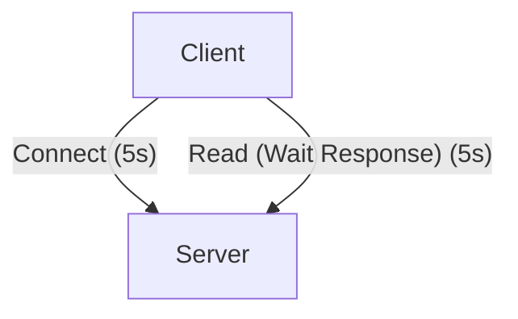
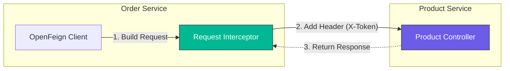

# OpenFeign (Declarative RPC)

### What & Why
**Concept**: OpenFeign is a declarative web service client. It makes writing web service clients easier.
**Difference**:
*   **RestTemplate**: Imperative. You build the URL, set headers, and execute.
*   **Feign**: Declarative. You define an interface, and Feign generates the implementation.

### Setup

#### 1. Dependency
`service-order/pom.xml`:
```xml
<dependency>
    <groupId>org.springframework.cloud</groupId>
    <artifactId>spring-cloud-starter-openfeign</artifactId>
</dependency>
```

#### 2. Enable Feign
`OrderMainApplication.java`:
```java
@EnableFeignClients
@SpringBootApplication
public class OrderMainApplication { ... }
```

#### 3. Define Client Interface
`ProductFeignClient.java`:
```java
// "service-product" is the application name in Nacos
@FeignClient(name = "service-product") 
public interface ProductFeignClient {
    
    // Matches the Controller method signature in Product Service
    @GetMapping("/api/product/{id}")
    Product getProductById(@PathVariable("id") Long id);
}
```

#### 4. Use It
`OrderServiceImpl.java`:
```java
@Autowired
private ProductFeignClient productFeignClient;

public Product getProduct(Long id) {
    // Looks like a local method call!
    return productFeignClient.getProductById(id);
}
```

### Integration with LoadBalancer
OpenFeign **automatically integrates** with Spring Cloud LoadBalancer. When you use `@FeignClient(name = "service-product")`, it will:
1.  Look up `service-product` in Nacos.
2.  Use the Load Balancer to pick an instance.
3.  Send the request.

### Advanced Usage

#### 5. Calling Third-Party APIs (No Service Discovery)
You can use Feign to call external APIs (like Google, Weather API) by specifying the `url`.

```java
@FeignClient(name = "weather-client", url = "https://api.weather.com")
public interface WeatherClient {
    @GetMapping("/current")
    String getWeather();
}
```

#### 6. Timeout Control
By default, Feign (and the underlying client) has timeout limits. You can configure them in `application.properties`.

```properties
# Connect Timeout: Time to establish connection
spring.cloud.openfeign.client.config.default.connect-timeout=5000
# Read Timeout: Time to wait for response
spring.cloud.openfeign.client.config.default.read-timeout=5000
```

**Granular Control**:
You can set timeouts for specific clients:
```properties
spring.cloud.openfeign.client.config.service-product.read-timeout=2000
```



#### 7. Retry Mechanism
Does Feign retry failed requests?

**Default Behavior**:
By default, OpenFeign uses `Retryer.NEVER_RETRY`. This means if a call fails (e.g., timeout or network error), it throws an exception immediately without retrying.

**How to Enable (Not Recommended for all cases)**:
You can enable it by defining a `Retryer` bean.

```java
@Bean
public Retryer feignRetryer() {
    // period=100ms, maxPeriod=1s, maxAttempts=3
    return new Retryer.Default(100, 1000, 3);
}
```

**Common Practice: Should we use it?**

*   **Idempotency Matters**:
    *   ✅ **Safe to Retry**: Idempotent operations like `GET` (reading data) or `PUT` (updating entire resource).
    *   ❌ **Dangerous**: Non-idempotent operations like `POST` (creating orders). Retrying a timed-out `POST` request might result in duplicate orders if the server actually processed the first request but the response was lost.
*   **Recommendation**:
    *   Keep Feign's default `NEVER_RETRY`.
    *   Use **Resilience4j** (Circuit Breaker) for more granular control. It handles retries, fallbacks, and circuit breaking more robustly than Feign's simple retryer.

#### 8. Request Interceptor

**What & Why**:
Interceptors allow you to modify the request template **before** the request is sent. This is crucial for cross-cutting concerns like:
- **Authentication**: Adding `Authorization` headers (e.g., JWT tokens) to every outgoing call.
- **Logging**: Adding correlation IDs.
- **Customization**: Modifying URL parameters dynamically.

**Implementation Example**:
Create a bean that implements `RequestInterceptor`.

```java
@Bean
public RequestInterceptor requestInterceptor() {
    return template -> {
        // Add a custom header to every request
        template.header("X-Token", "SECRET-123");
        
        // Log the request
        System.out.println("Intercepted Feign Request: " + template.url());
    };
}
```

**Interception Flow**:



#### 9. Fallback (Preview)

**What & Why**:
When a remote service fails (timeout, error, or downtime), a **Fallback** provides a default value or alternative logic, preventing the failure from cascading to the user.

**Implementation**:
1.  Create a class implementing the Feign interface (`ProductFeignClient`).
2.  Annotate it with `@Component`.
3.  Link it in `@FeignClient`.

```java
// 1. Define Fallback
@Component
public class ProductFeignClientFallback implements ProductFeignClient {
    @Override
    public Product getProductById(Long id) {
        // Return dummy data or safe default
        return new Product(-1L, "Default Product (Service Down)", BigDecimal.ZERO, 0);
    }
}

// 2. Link in Client
@FeignClient(name = "service-product", fallback = ProductFeignClientFallback.class)
public interface ProductFeignClient { ... }
```

**⚠️ Important Note: Sentinel Integration**
Just defining a `fallback` class **won't work automatically** for circuit breaking in Spring Cloud Alibaba unless a circuit breaker implementation is present and enabled.

In this stack, **Sentinel** is the standard solution.
*   **Without Sentinel**: Fallback might only trigger on specific exceptions (like IO errors) but won't provide true circuit breaking (stop calling after N failures).
*   **With Sentinel**: We get full flow control, degradation, and circuit breaking capabilities.

*We will explore Sentinel in the next chapter to fully activate this feature.*
