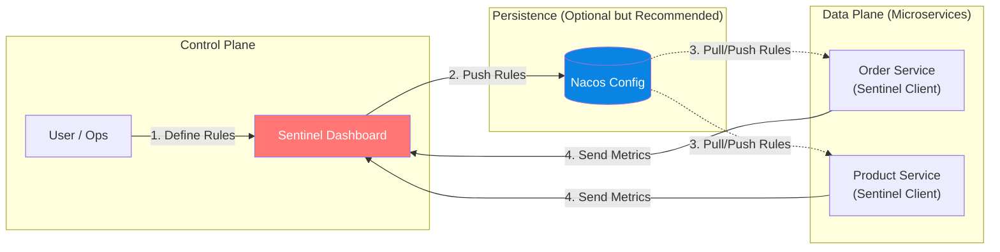
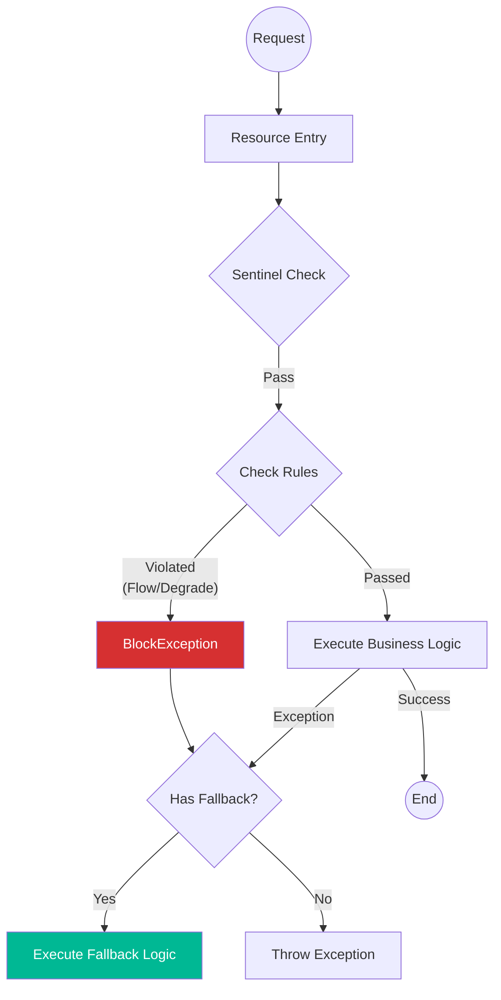

# Sentinel (Flow Control & Reliability)

### What & Why
Sentinel is a powerful "traffic guard" for microservices. As services communicate, stability becomes critical. Sentinel protects your system from cascading failures using **Flow Control**, **Circuit Breaking**, **System Adaptive Protection**, and **Hotspot Traffic Control**.

### Architecture
Sentinel operates in a Client-Server model:
*   **Sentinel Client (Your App)**: Integrated into microservices (Web, Dubbo, OpenFeign). It reports metrics to the dashboard and pulls rules.
*   **Sentinel Dashboard**: A web console to view real-time metrics and configure rules dynamically.
*   **Rules Storage**: Rules are pushed to clients. For production, they should be persisted in Nacos/Zookeeper (Push Mode).



### Core Concepts: Resources & Rules

1.  **Resources**: Anything you want to protect.
    *   **Auto-Adapted**: Web APIs (`/api/order/create`), Dubbo methods, Feign clients.
    *   **Manual**: Code blocks wrapped in `@SentinelResource`.
2.  **Rules**: Policies applied to resources.
    *   **Flow Control (`FlowRule`)**: Limit QPS (e.g., max 10 req/s).
    *   **Degrade (`DegradeRule`)**: Circuit breaking (stop calling if error rate > 50% or RT > 500ms).
    *   **System Protection (`SystemRule`)**: Protect based on CPU/Load.
    *   **Hotspot (`ParamFlowRule`)**: Limit specific parameters (e.g., limit `productId=123`).

### Workflow

Every request goes through a chain of slots (processors).



### Dashboard Setup

1.  **Download**: Get `sentinel-dashboard-1.8.9.jar` (or latest) from [GitHub Releases](https://github.com/alibaba/Sentinel/releases).
2.  **Run**:
    ```bash
    java -Dserver.port=8859 -jar sentinel-dashboard-1.8.9.jar
    ```
3.  **Access**: `http://localhost:8859` (User/Pass: `sentinel` / `sentinel`).

### Quick Start: Flow Control Test

We have protected the Order creation logic with `@SentinelResource`.

**1. Code Setup (`OrderServiceImpl.java`)**:
```java
@SentinelResource(value = "createOrder") // Define resource name
@Override
public Order createOrder(...) {
    // ...
}
```

**2. Register Resource**:
Sentinel is lazy-loaded. You must trigger the endpoint once to see it in the dashboard.
```bash
curl -X POST "http://localhost:8001/api/order/create?userId=1&productId=1&count=1"
```

**3. Configure Rule**:
1.  Go to Dashboard -> **service-order** -> **Flow Control**.
2.  Click **+ Add Flow Rule**.
3.  **Resource Name**: `createOrder`.
4.  **QPS Threshold**: `1`.
5.  Click **Add**.

**4. Verify Blocking**:
Spam the request (more than 1 per second).

**Result**:
You will see the default blocking message:
> BlockedbySentinel(flowlimiting)
