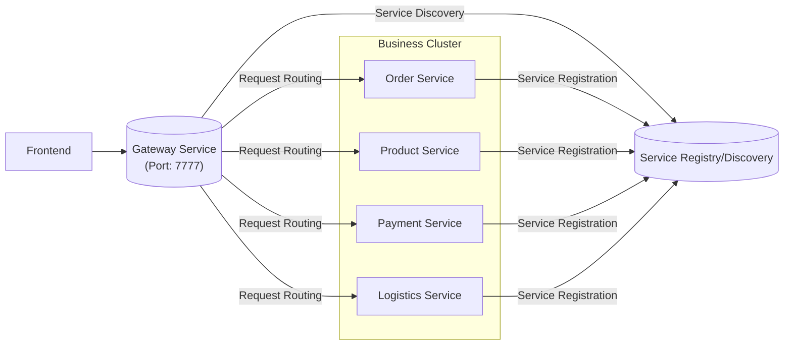

# Gateway

### What & Why
The API Gateway acts as the single entry point for all clients. Instead of calling individual services (Order, Product) directly, clients send requests to the Gateway, which routes them to the appropriate service.

**Key Features**:
1.  **Unified Entry**: Single point of access for all microservices.
2.  **Request Routing**: Routes requests to the correct service based on path or other criteria.
3.  **Load Balancing**: Distributes traffic across service instances.
4.  **Traffic Control**: Rate limiting and flow control.
5.  **Identity Authentication**: Centralized auth verification.
6.  **Protocol Conversion**: Translates between protocols (e.g., HTTP to RPC).
7.  **System Monitoring**: Observability and logging.
8.  **Security Protection**: Firewall, IP whitelisting, etc.

### Architecture



### Technology Choice: Reactive vs MVC

We chose **Spring Cloud Gateway (Reactive)** over the MVC variant for its superior efficiency in handling high concurrency.

*   **Reactive (WebFlux)**: Built on Project Reactor and Netty. Uses a non-blocking, event-loop model. Ideal for IO-intensive tasks like routing, allowing it to handle more concurrent requests with fewer threads.
*   **MVC (Servlet)**: Built on the traditional Servlet API. Uses a blocking, thread-per-request model.

**Important Note on Dependencies**:
As of recent Spring Cloud versions, the artifact names have become more explicit.
> `spring-cloud-starter-gateway` is deprecated. Please use `spring-cloud-starter-gateway-server-webflux` instead.

We explicitly use the WebFlux starter in `gateway/pom.xml`:
```xml
<dependency>
    <groupId>org.springframework.cloud</groupId>
    <artifactId>spring-cloud-starter-gateway-server-webflux</artifactId>
</dependency>
<dependency>
    <groupId>org.springframework.cloud</groupId>
    <artifactId>spring-cloud-starter-loadbalancer</artifactId>
</dependency>
```

**Load Balancer Dependency**:
We use `spring-cloud-starter-loadbalancer` instead of the bare `spring-cloud-loadbalancer`. The starter ensures all necessary auto-configurations are present, which is required for resolving `lb://` URIs in Gateway routes.

**Configuration Update**:
With the new `gateway-server-webflux` starter, the route configuration property has moved.
*   **Old**: `spring.cloud.gateway.routes`
*   **New**: `spring.cloud.gateway.server.webflux.routes`

### Core Concepts: Predicates & Filters

The Gateway works on a simple yet powerful flow: **Match (Predicate) -> Process (Filter) -> Route**.

*   **Route Predicate**: The logic that decides *if* a request matches a route.
    *   *Examples*: Path (`/api/**`), Method (`GET`), Header, Host, etc.
*   **Gateway Filter**: Logic applied to specific routes to modify the request or response.
    *   *Examples*: `AddRequestHeader`, `StripPrefix`, `Retry`.
    *   *Flow*: Filters act in a chain. **Pre-filters** run before sending the request to the downstream service. **Post-filters** run after receiving the response.
*   **Global Filter**: Logic applied to **all** routes.
    *   *Use Cases*: Logging, Metrics, Authentication.
*   **Customization**: You can write your own `GlobalFilter` or `GatewayFilterFactory` for custom business logic.

For a complete list of built-in predicates and filters, refer to the [Official Spring Cloud Gateway Documentation](https://docs.spring.io/spring-cloud-gateway/docs/current/reference/html/).

### Cross-Origin Resource Sharing (CORS)

**Why configure it at the Gateway?**
Browsers enforce the Same-Origin Policy. When your frontend (e.g., `localhost:8080`) tries to call your API (e.g., `localhost:7777`), the browser blocks it unless CORS is configured.

Configuring CORS at the **Gateway** level is the best practice because:
1.  **Centralization**: You define the rules (allowed origins, methods, headers) in one place, rather than repeating them in every microservice (Order, Product, etc.).
2.  **Efficiency**: The Gateway handles the preflight (`OPTIONS`) requests, offloading this burden from your business services.

For configuration details, refer to the [CORS Configuration Documentation](https://docs.spring.io/spring-cloud-gateway/docs/current/reference/html/#cors-configuration).
