# Distributed Transactions (Seata)

### The Problem: Local Transactions in a Distributed World

In our current microservices architecture, each service manages its own database transaction using `@Transactional`:

*   **Order Service**: Starts a transaction, creates an order, and commits.
*   **Product Service**: Starts a transaction, deducts stock, and commits.

**The Failure Scenario**:
Imagine the following flow in `createOrder`:
1.  **Product Service** is called via Feign. It successfully deducts stock and commits its transaction.
2.  **Order Service** continues execution but encounters an error (e.g., unexpected crash or exception) *before* committing its own transaction.
3.  **Result**:
    *   Order Service **rolls back** (No Order created).
    *   Product Service **has already committed** (Stock deducted).
    *   **Data Inconsistency**: We lost inventory but gained no order.

```mermaid
sequenceDiagram
    participant Client
    participant Order as Order Service (Tx A)
    participant Product as Product Service (Tx B)
    participant DB_Order as Order DB
    participant DB_Product as Product DB

    Client->>Order: createOrder()
    Order->>Order: Start Tx A
    
    Order->>Product: deductStock() (Feign)
    Product->>Product: Start Tx B
    Product->>DB_Product: UPDATE stock = stock - 1
    Product->>Product: Commit Tx B (Permanent!)
    Product-->>Order: Success
    
    Order->>Order: ...Processing...
    Note right of Order: 💥 ERROR / EXCEPTION 💥
    
    Order->>Order: Rollback Tx A
    Note over DB_Order: No Order Created
    Note over DB_Product: Stock Deducted (Inconsistent!)
    Order-->>Client: Failure Response
```



### The Solution: Distributed Transaction Manager

To solve this, we need a mechanism to ensure that **either all** services commit **or all** roll back, maintaining data consistency across the distributed system. This is where **Seata** comes in.

#### How Seata Works

Seata uses a three-role architecture to manage distributed transactions:

1.  **TC (Transaction Coordinator)**:
    *   **Role**: The "Boss". A separate server (like Nacos) that maintains the status of the global transaction and all branch transactions.
    *   **Responsibility**: Drives the global commit or rollback.

2.  **TM (Transaction Manager)**:
    *   **Role**: The "Requester". Usually embedded in the service that starts the flow (e.g., Order Service).
    *   **Responsibility**: Defines the scope of the global transaction. It tells the TC to "Begin", "Commit", or "Rollback" the global transaction.

3.  **RM (Resource Manager)**:
    *   **Role**: The "Worker". Embedded in every service that touches a database (e.g., Order, Product, Account).
    *   **Responsibility**: Manages the local database resources. It registers its branch transaction with the TC and reports its status (success/failure).

**The Workflow**:
1.  **TM** asks **TC** to begin a new Global Transaction.
2.  **TM** calls microservices (the **RMs**).
3.  Each **RM** executes its local SQL, but before committing, it registers with **TC**.
4.  If any **RM** fails, **TM** tells **TC** to rollback. **TC** then instructs all **RMs** to undo their changes.

### Mapping Seata to Our Architecture

In our `rainy-spring-cloud` project, the roles are assigned as follows:


*   **TC**: The standalone Seata Server we need to deploy.
*   **TM**: The `Order Service` (specifically the `createOrder` method), which initiates the global transaction.
*   **RM**: Both `Order Service` and `Product Service` act as RMs because they both interact with their respective databases (`rainy_order` and `rainy_product`).

For more details, refer to the [Official Seata Documentation](https://seata.apache.org/docs/overview/what-is-seata/).

### Setup Guide

#### Step 1: Check Version
First, check the Seata version defined in your `spring-cloud-alibaba-dependencies` (usually in the root `pom.xml` or inherited BOM).
> For this project, the Seata version is **2.5.0**.

#### Step 2: Seata Server Setup
1.  **Download**: Download the Seata Server package from the [Official Release Page](https://github.com/apache/incubator-seata/releases).
2.  **Start**: Navigate to the `bin` folder and run the startup script.
    ```bash
    ./seata-server.sh
    ```
    *   This starts the server in the **background** (nohup).
    *   **Port**: Default is `8091`.
    *   **Logs**: Check `nohup.out` for startup logs.
    *   **Note**: The old Web UI at port `7091` is no longer available in newer versions.
3.  **Stop**: To stop the server, you need to manually kill the process (e.g., `kill -9 <pid>`).

#### Step 3: Client Configuration
To enable Seata in your microservices (Order, Product, etc.):

1.  **Add Dependency**:
    Add the starter to your service's `pom.xml`:
    ```xml
    <dependency>
        <groupId>com.alibaba.cloud</groupId>
        <artifactId>spring-cloud-starter-alibaba-seata</artifactId>
    </dependency>
    ```

2.  **Configuration**:
    While Seata supports Nacos for configuration management (recommended for production), for simplicity we will use a local `file.conf` in each service's `resources` folder.

    **file.conf**:
    ```conf
    service {
      # Transaction service group mapping
      # Format: vgroupMapping.<TxServiceGroup> = "<SeataServerGroup>"
      vgroupMapping.default_tx_group = "default"
      
      # Only support when registry.type=file
      default.grouplist = "127.0.0.1:8091"
      
      # Degrade current not support
      enableDegrade = false
      
      # Disable Seata
      disableGlobalTransaction = false
    }
    ```

#### Step 4: Database Setup (AT Mode)
We are using **AT Mode** (Automatic Transaction), which requires an `undo_log` table in **each** microservice's database to store the before/after images of data for rollback.

1.  **Create Table**: Run the following SQL in both `rainy_order` and `rainy_product` databases.
    *   [Official undo_log SQL Script](https://seata.apache.org/docs/user/quickstart/?utm_source=chatgpt.com#step-2-create-undo_log-table)

    ```sql
    -- Standard Seata AT Mode Undo Log Table
    CREATE TABLE IF NOT EXISTS `undo_log` (
        `branch_id`     BIGINT       NOT NULL COMMENT 'branch transaction id',
        `xid`           VARCHAR(128) NOT NULL COMMENT 'global transaction id',
        `context`       VARCHAR(128) NOT NULL COMMENT 'undo_log context,such as serialization',
        `rollback_info` LONGBLOB     NOT NULL COMMENT 'rollback info',
        `log_status`    INT(11)      NOT NULL COMMENT '0:normal status,1:defense status',
        `log_created`   DATETIME(6)  NOT NULL COMMENT 'create datetime',
        `log_modified`  DATETIME(6)  NOT NULL COMMENT 'modify datetime',
        UNIQUE KEY `ux_undo_log` (`xid`, `branch_id`)
    ) ENGINE = InnoDB AUTO_INCREMENT = 1 DEFAULT CHARSET = utf8mb4 COMMENT ='AT transaction mode undo table';
    ```

#### Step 5: Enable Global Transaction
Finally, annotate your business entry point (Transaction Manager) with `@GlobalTransactional`.

**OrderServiceImpl.java**:
```java
    @GlobalTransactional // <--- Starts the Global Transaction (Seata)
    @Transactional       // <--- Still needed for the Local Transaction (Database)
    @SentinelResource(value = "createOrder", blockHandler = "createOrderFallback")
    @Override
    public Order createOrder(Long productId, Long userId, int count) {
        // ... business logic ...
    }
```
*   **@GlobalTransactional**: Tells Seata to begin a global transaction. If any participant fails, Seata coordinates a global rollback.
*   **@Transactional**: Ensures the local database operations (e.g., inserting the order) are part of a local transaction.
*   **@SentinelResource**: Wraps the method for flow control and circuit breaking.

### How Seata AT Mode Works

Seata AT mode is a non-intrusive distributed transaction solution. It relies on a two-phase commit protocol but optimizes it for performance by committing local transactions **early** (in Phase 1), rather than holding database locks until Phase 2.

#### Phase 1: Execute & Prepare (The Local Commit)
In this phase, Seata intercepts your business SQL execution to generate an "Undo Log" before committing the local transaction.

1.  **Parse SQL**: Seata analyzes your SQL (e.g., `UPDATE storage_tbl SET count = count - 2 ...`).
2.  **Before Image**: Queries the data **before** the update to save the original state.
3.  **Execute SQL**: Executes the business SQL updates the database.
4.  **After Image**: Queries the data **after** the update to save the new state.
5.  **Insert Undo Log**: Inserts a record into the `undo_log` table containing both images and the Global Transaction ID (XID).
6.  **Local Commit**: Commits the Business SQL and the Undo Log insertion in **one local transaction**.
7.  **Report**: Reports the branch status to the TC (Transaction Coordinator).

#### Phase 2: Global Commit or Rollback
The TC decides whether to commit or rollback based on the status of all branches.

*   **Scenario A: Global Commit (All Success)**
    1.  TC notifies RMs (Resource Managers) to **Commit**.
    2.  RMs place the task in an async queue.
    3.  **Action**: RMs simply **delete** the `undo_log` record (since the data is already committed).
    4.  *Efficiency*: This is extremely fast as no database rollback is needed.

*   **Scenario B: Global Rollback (Any Failure)**
    1.  TC notifies RMs to **Rollback**.
    2.  RMs find the corresponding `undo_log` record using XID and Branch ID.
    3.  **Validation**: Compares the current database data with the **After Image**.
        *   *Why?* To ensure no other dirty writes occurred since Phase 1.
    4.  **Restore**: Uses the **Before Image** to restore the data to its original state.
    5.  **Cleanup**: Deletes the `undo_log` record.

#### Visualizing the AT Protocol


### Other Seata Modes (Brief Comparison)

Besides AT Mode (default), Seata supports three other modes for different scenarios:

1.  **TCC Mode (Try-Confirm-Cancel)**
    *   **Mechanism**: You manually implement three methods: `prepare` (Try), `commit` (Confirm), and `rollback` (Cancel).
    *   **Pros**: High performance; doesn't rely on database transactions.
    *   **Cons**: Invasive (requires writing a lot of code).
    *   **Use Case**: High-concurrency scenarios or when resources are not databases (e.g., Redis).

2.  **Saga Mode**
    *   **Mechanism**: A sequence of local transactions. If one fails, compensating transactions are executed in reverse order.
    *   **Pros**: Handles long-running business processes; asynchronous.
    *   **Cons**: No isolation (dirty reads possible); complex compensation logic.
    *   **Use Case**: Legacy systems or long chains of services.

3.  **XA Mode**
    *   **Mechanism**: Standard 2PC protocol supported by the database itself.
    *   **Pros**: Strong consistency; standard.
    *   **Cons**: Blocking (locks resources until global commit); lower performance.
    *   **Use Case**: Financial systems requiring strict ACID compliance.
