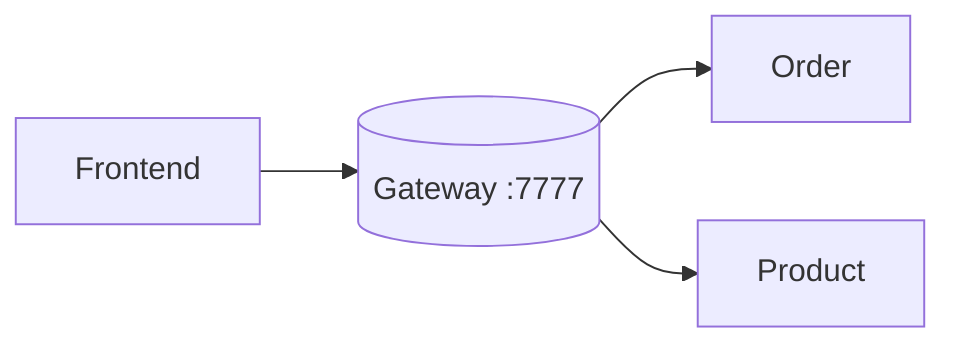

# API Gateway

## Architecture
The API Gateway is the single entry point, handling routing, filtering, and auth.

## Technology Choice
We use **Spring Cloud Gateway (Reactive/WebFlux)** for high concurrency.
**Note**: `spring-cloud-starter-gateway` is deprecated. Use `spring-cloud-starter-gateway-server-webflux`.

## Core Concepts
- **Predicate**: Matches requests (Path, Method, Header).
- **Filter**: Modifies requests/responses (AddHeader, StripPrefix).
- **Route**: Predicate + Filter + URI.

## CORS Configuration
Configured globally at the Gateway to handle Same-Origin Policy.
Allows frontend (`localhost:8080`) to talk to backend (`localhost:7777`).
