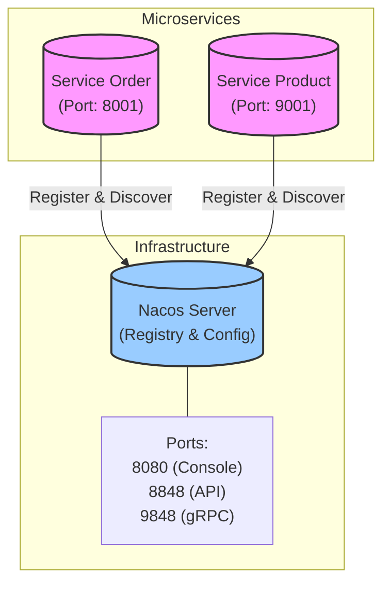

# rainy-spring-cloud


☔ **Experiments with Distributed Systems in Spring Cloud.**

This project demonstrates a complete microservices architecture using the latest Spring Cloud Alibaba stack.

## Architecture



## Project Structure

This is a multi-module Maven project structured as follows:

```
rainy-spring-cloud
├── gateway                 # API Gateway (Port: 7777)
├── rainy-common            # Shared entities (Order/Product/...)
├── services               # Container for microservices
│   ├── service-order      # Order Management Service
│   └── service-product    # Product Management Service
└── pom.xml                # Root Maven configuration
```

## Technology Stack

- **Java**: 17
- **Spring Boot**: 3.5.9
- **Spring Cloud**: 2025.0.1
- **Spring Cloud Alibaba**: 2025.0.0.0
- **Service Discovery**: Nacos

## Quick Start (Local)

Prereqs: Nacos at `127.0.0.1:8848` and MySQL schemas `rainy_product` / `rainy_order` (see “Database Setup”).

```bash
# Start service-product (default: 9001)
./mvnw -pl services/service-product spring-boot:run

# Start service-order (default: 8001)
./mvnw -pl services/service-order spring-boot:run
```

```bash
# Smoke checks
curl http://localhost:9001/api/product/hello
curl http://localhost:9001/api/product/1
curl -X POST "http://localhost:8001/api/order/create?userId=1&productId=1&count=1"
curl http://localhost:8001/api/order/config
```
