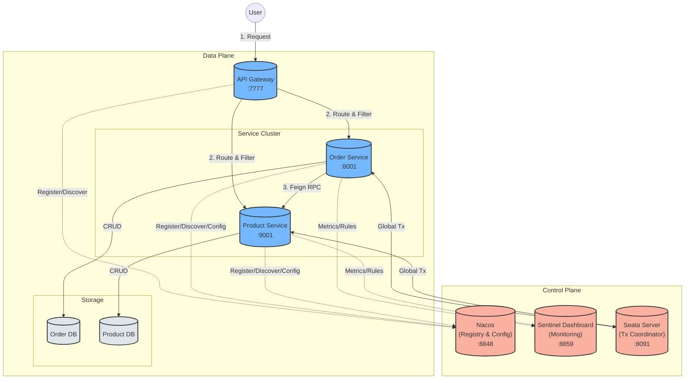

# Welcome to rainy-spring-cloud

☔ **Experiments with Distributed Systems in Spring Cloud.**

This project demonstrates a complete microservices architecture using the latest Spring Cloud Alibaba stack.

## Architecture Overview

## Technology Stack

- **Java**: 17
- **Spring Boot**: 3.5.9
- **Spring Cloud**: 2025.0.1
- **Spring Cloud Alibaba**: 2025.0.0.0
- **Service Discovery & Config**: Nacos
- **Resilience**: Sentinel
- **Gateway**: Spring Cloud Gateway (WebFlux)
- **Distributed Transaction**: Seata
