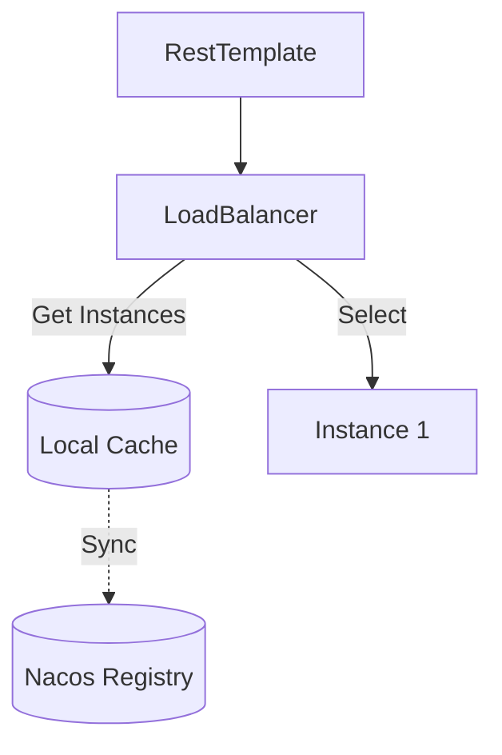

# Load Balancing

## Why?
In production, you have multiple instances of `service-product`. We need to distribute requests across them. Hardcoding URLs defeats the purpose of clustering.

## Dependencies
We use **Spring Cloud LoadBalancer** (Ribbon is dead).

```xml
<dependency>
    <groupId>org.springframework.cloud</groupId>
    <artifactId>spring-cloud-loadbalancer</artifactId>
</dependency>
```

## Approach 1: Manual (`LoadBalancerClient`)
Explicitly ask the Load Balancer to pick an instance.

```java
ServiceInstance instance = loadBalancerClient.choose("service-product");
String url = String.format("http://%s:%s/...", instance.getHost(), instance.getPort());
```

## Approach 2: Annotation (`@LoadBalanced`) - Recommended ★
Spring injects an interceptor into `RestTemplate` that automatically resolves service names.

**1. Configure RestTemplate**
```java
@Bean
@LoadBalanced
public RestTemplate restTemplate() {
    return new RestTemplate();
}
```

**2. Use Service Name**
```java
String url = "http://service-product/api/product/" + id;
restTemplate.getForObject(url, Product.class);
```

## Client-Side vs Server-Side
- **Client-side**: Caller decides (this project). Uses local cache of registry.
- **Server-side**: Nginx/Gateway decides. Caller talks to a single VIP.

## Caching Mechanism
The client maintains a **local cache** of the service registry to avoid hitting Nacos for every request.


