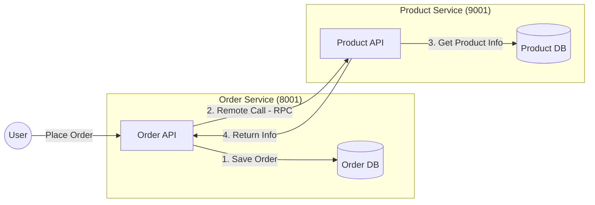

# Remote Procedure Call (RPC)

## Architecture
We are building a system where the **Order Service** needs to fetch product details from the **Product Service**.



## Implementation Summary
We initially implemented a **manual RPC** to understand the concept:
1.  **Discovery**: Ask Nacos for `service-product` instances.
2.  **Selection**: Pick the first available instance.
3.  **Call**: Use `RestTemplate` to call `http://ip:port/api/product/{id}`.

```java
// Manual RPC glue code
List<ServiceInstance> instances = discoveryClient.getInstances("service-product");
ServiceInstance instance = instances.get(0);
String url = String.format("http://%s:%s/api/product/%s", instance.getHost(), instance.getPort(), productId);
Product product = restTemplate.getForObject(url, Product.class);
```

## Database Setup
We intentionally **avoid Foreign Keys** for decoupling.

### Product Service (`rainy_product`)
```sql
CREATE DATABASE IF NOT EXISTS rainy_product;
CREATE TABLE t_product (
    id BIGINT PRIMARY KEY AUTO_INCREMENT,
    name VARCHAR(255) NOT NULL,
    price DECIMAL(10, 2) NOT NULL,
    stock INT NOT NULL
);
INSERT INTO t_product (name, price, stock) VALUES ('Rainy Cloud Umbrella', 99.00, 100);
```

### Order Service (`rainy_order`)
```sql
CREATE DATABASE IF NOT EXISTS rainy_order;
CREATE TABLE t_order (
    id BIGINT PRIMARY KEY AUTO_INCREMENT,
    user_id BIGINT,
    total_amount DECIMAL(10, 2),
    ...
);
CREATE TABLE t_order_item ( ... );
```

## Order Creation Logic (MyBatis-Plus)
1.  **Receive Request**: `OrderController` gets `userId`, `productId`.
2.  **RPC**: `OrderService` asks `ProductService` for price.
3.  **Save**: Insert into `t_order` and `t_order_item`.

We use `MyBatis-Plus` for easy CRUD. Entities map to tables (`@TableName`), and Mappers extend `BaseMapper<T>`.
